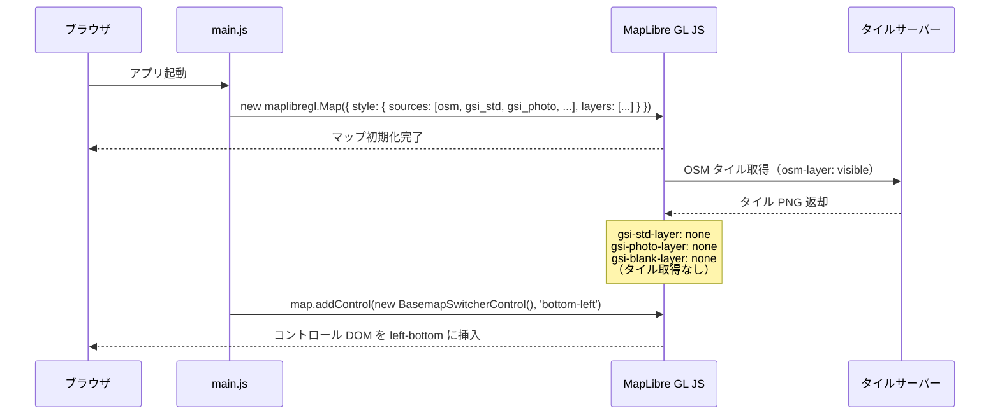
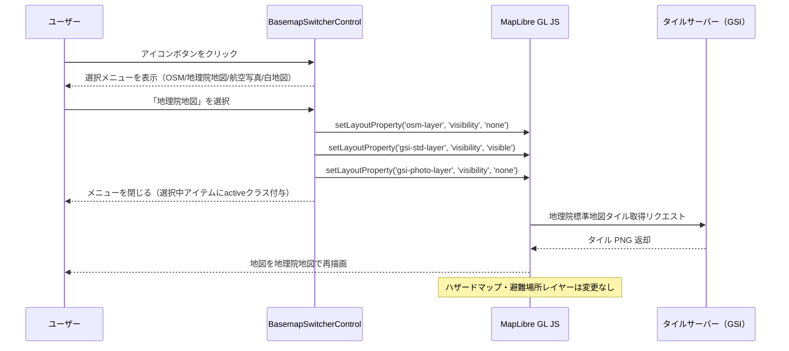
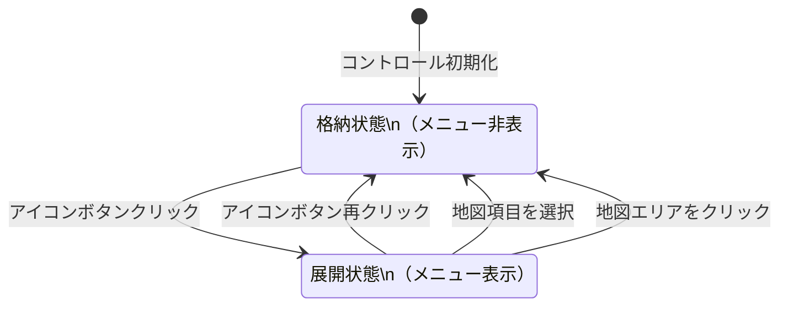
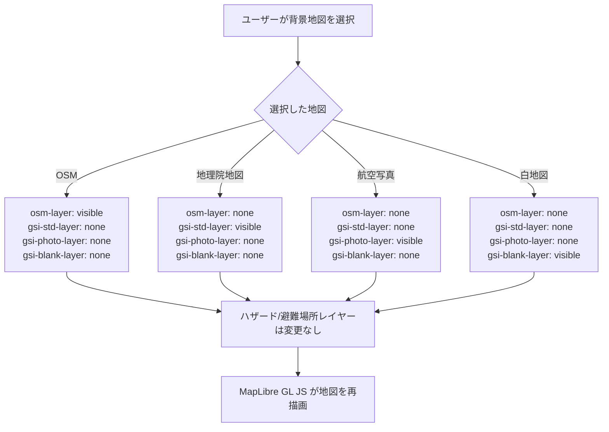
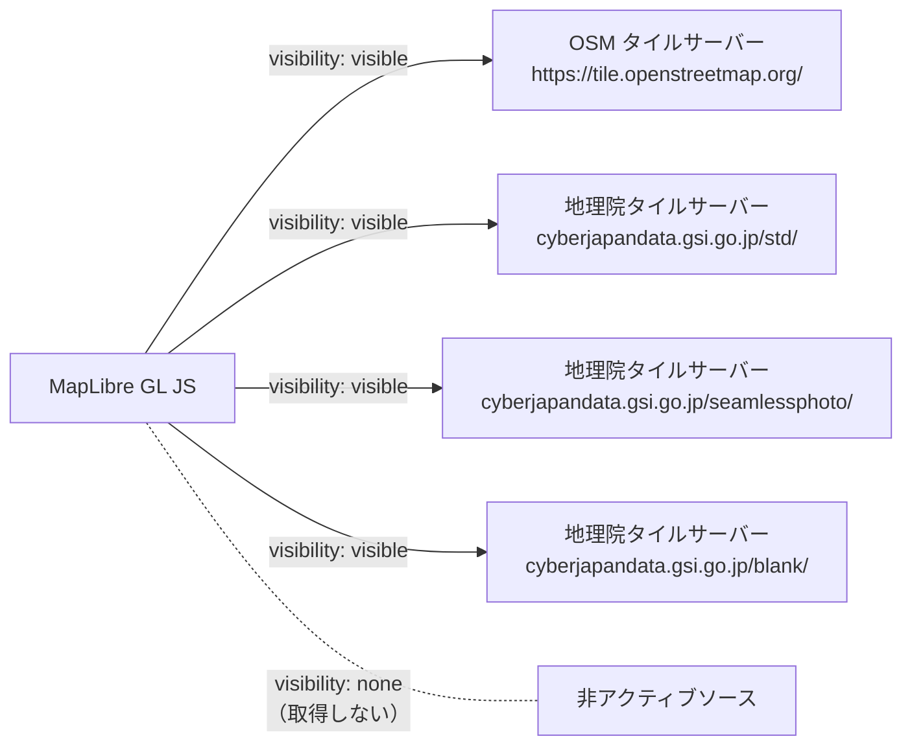
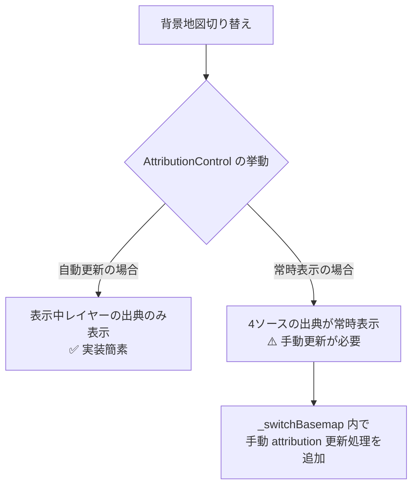

# 背景地図切り替え機能 データフロー図

**作成日**: 2026-04-21
**関連アーキテクチャ**: [architecture.md](architecture.md)
**関連要件定義**: [requirements.md](../../spec/basemap-switcher/requirements.md)

**【信頼性レベル凡例】**:
- 🔵 **青信号**: EARS要件定義書・設計文書・ユーザヒアリングを参考にした確実なフロー
- 🟡 **黄信号**: EARS要件定義書・設計文書・ユーザヒアリングから妥当な推測によるフロー
- 🔴 **赤信号**: EARS要件定義書・設計文書・ユーザヒアリングにない推測によるフロー

---

## 初期化フロー 🔵

**信頼性**: 🔵 *既存 main.js 実装パターン・ユーザヒアリング（4ソース初期定義方式）より*

**関連要件**: REQ-002, REQ-005

---

## 背景地図切り替えフロー 🔵

**信頼性**: 🔵 *ユーザヒアリング（4ソース初期定義方式）・REQ-001〜005より*

**関連要件**: REQ-001, REQ-002, REQ-003, REQ-004, REQ-005

---

## コントロールUI状態遷移 🔵

**信頼性**: 🔵 *REQ-001・ユーザヒアリング（アイコンボタン形式）より*

---

## レイヤー可視状態管理フロー 🔵

**信頼性**: 🔵 *ユーザヒアリング（4ソース初期定義方式）・REQ-005より*

---

## タイル取得フロー 🟡

**信頼性**: 🟡 *MapLibre GL JS の内部動作から妥当な推測*

MapLibre GL JS は `visibility: 'visible'` のレイヤーに対してのみタイルを取得する。

---

## 出典表示（Attribution）更新フロー 🟡

**信頼性**: 🟡 *MapLibre GL JS の AttributionControl 動作から妥当な推測。実装時に検証が必要*

**注意**: MapLibre GL JS の `AttributionControl` はソースの `visibility` ではなく、ソースの存在を基準に attribution を収集する場合がある。4ソース全てが初期スタイルに存在するため、複数の attribution が常に表示される可能性がある。

**対応方針**: 実装時に `AttributionControl` の挙動を検証し、必要であれば `_switchBasemap` メソッド内でカスタム attribution 更新処理を追加する。

---

## 関連文書

- **アーキテクチャ**: [architecture.md](architecture.md)
- **ヒアリング記録**: [design-interview.md](design-interview.md)
- **要件定義**: [requirements.md](../../spec/basemap-switcher/requirements.md)

---

## 信頼性レベルサマリー

- 🔵 青信号: 4件（67%）
- 🟡 黄信号: 2件（33%）
- 🔴 赤信号: 0件（0%）

**品質評価**: ✅ 高品質（🟡項目は実装時の検証ポイントとして管理）
