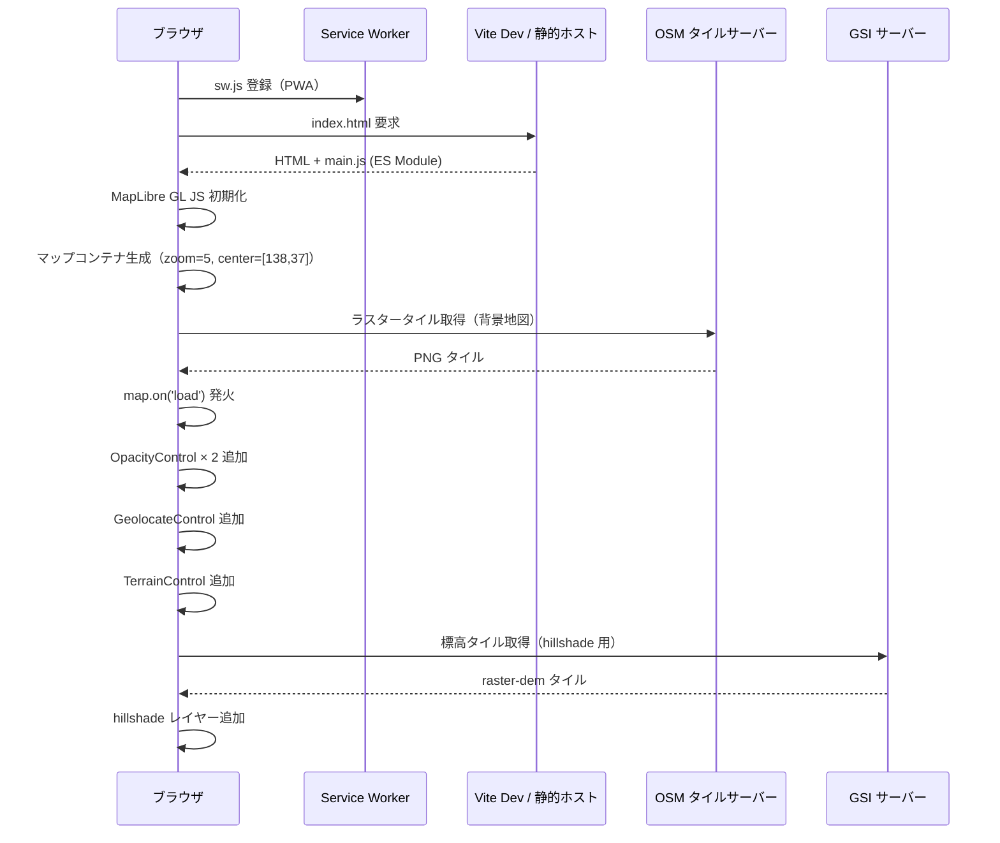
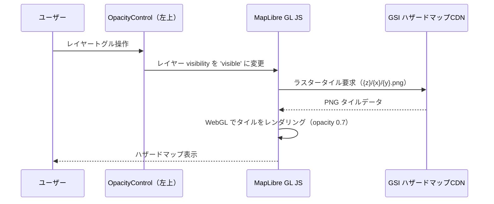
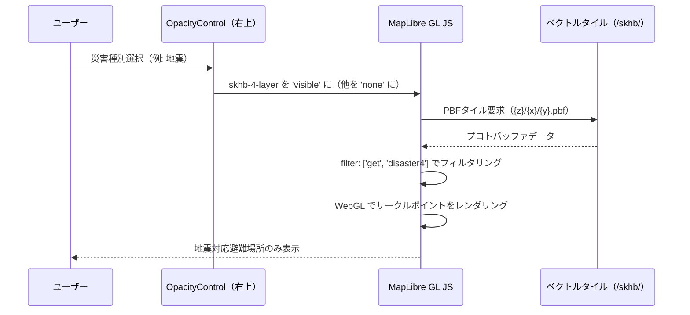
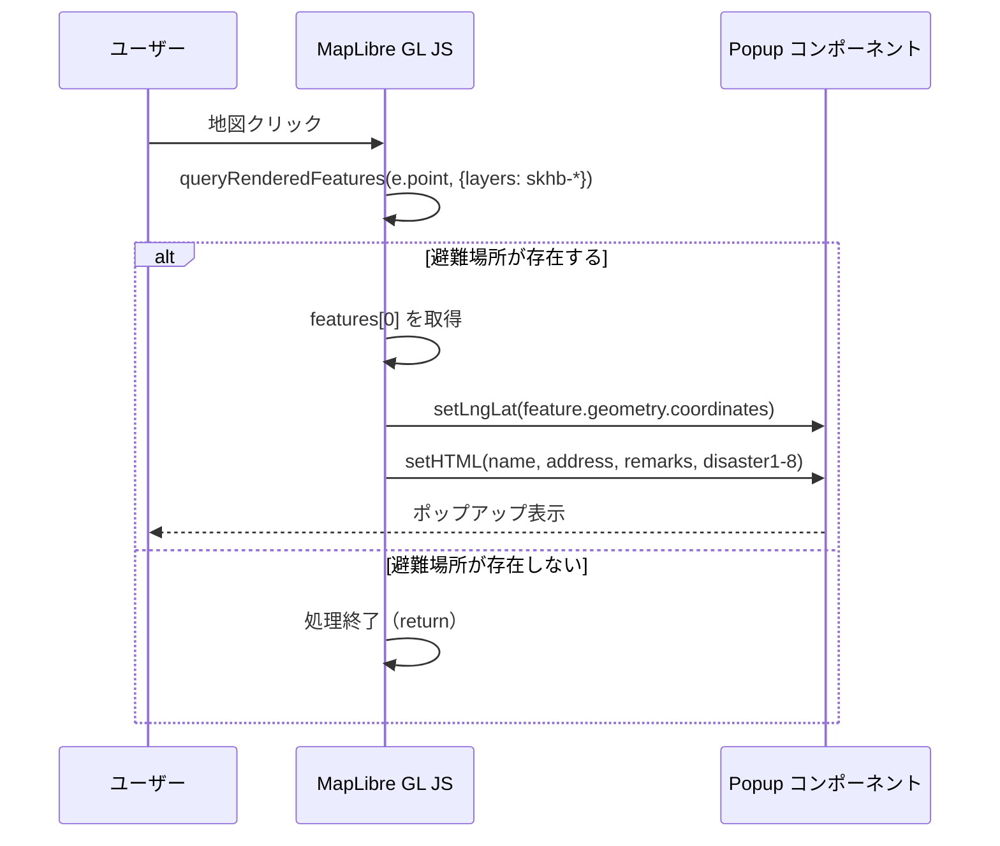
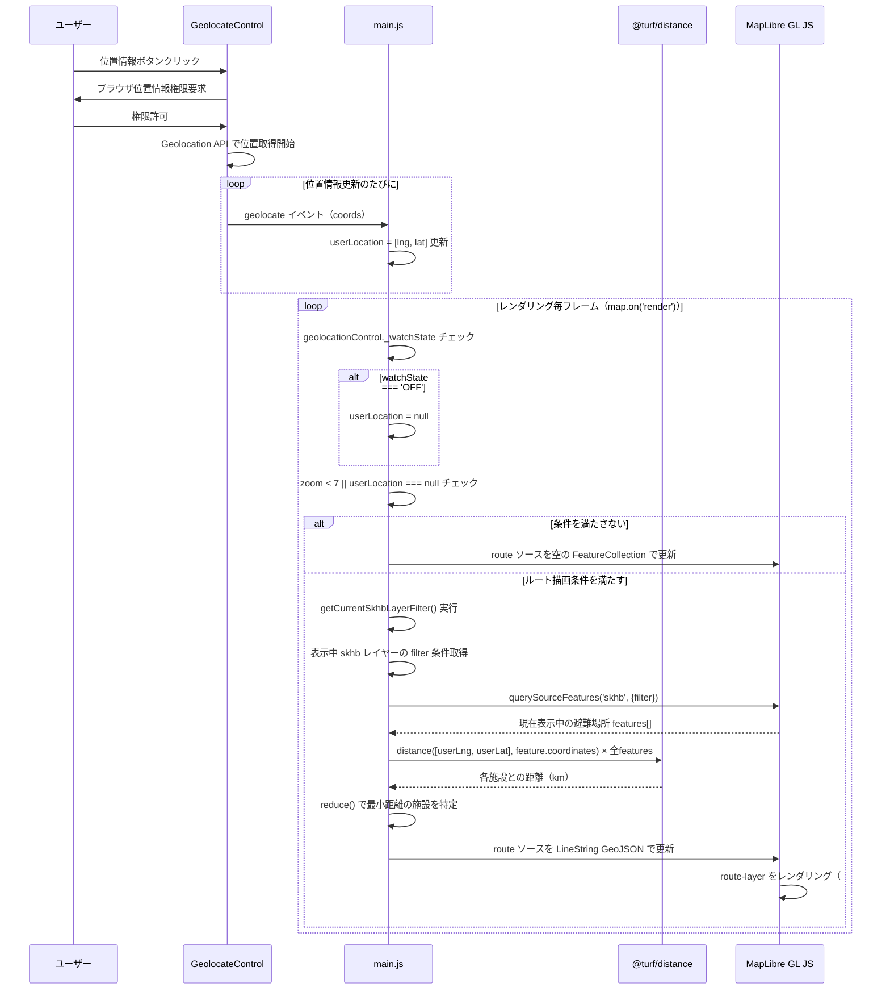
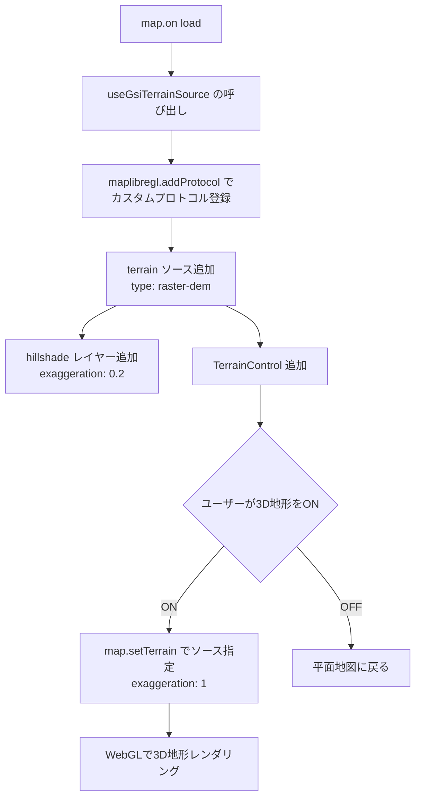
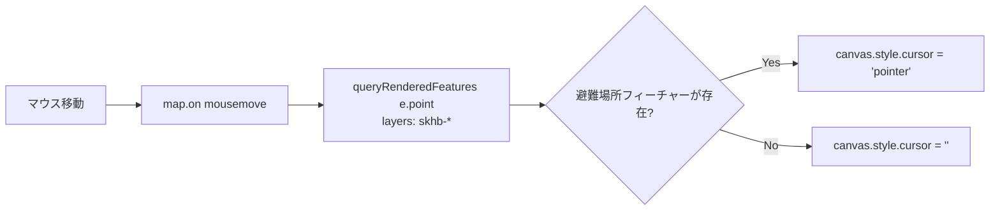
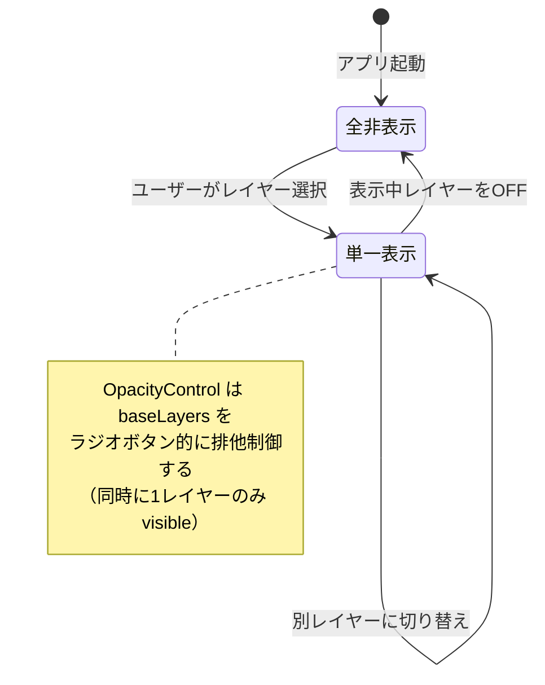

# 防災マップ データフロー設計（逆生成）

## 分析日時

2026-04-20

---

## 1. アプリケーション起動フロー



---

## 2. ハザードマップ表示フロー



ハザードマップ一覧:

| レイヤーID | データURL |
|-----------|----------|
| `hazard_flood-layer` | `disaportaldata.gsi.go.jp/raster/01_flood_l2_shinsuishin_data` |
| `hazard_hightide-layer` | `disaportaldata.gsi.go.jp/raster/03_hightide_l2_shinsuishin_data` |
| `hazard_tsunami-layer` | `disaportaldata.gsi.go.jp/raster/04_tsunami_newlegend_data` |
| `hazard_doseki-layer` | `disaportaldata.gsi.go.jp/raster/05_dosekiryukeikaikuiki` |
| `hazard_kyukeisha-layer` | `disaportaldata.gsi.go.jp/raster/05_kyukeishakeikaikuiki` |
| `hazard_jisuberi-layer` | `disaportaldata.gsi.go.jp/raster/05_jisuberikeikaikuiki` |

---

## 3. 避難場所表示フロー



---

## 4. 避難場所クリック（ポップアップ）フロー



ポップアップ表示データ（ベクトルタイル属性から取得）:

| 属性 | 型 | 表示方法 |
|------|----|---------|
| `name` | String | 太字、1.2rem フォント |
| `address` | String | 通常テキスト |
| `remarks` | String（nullable） | `?? ''` でnull対応 |
| `disaster1`〜`disaster8` | Boolean | true: 通常色 / false: `color:#ccc` グレーアウト |

---

## 5. 位置情報取得・最近傍ルート描画フロー



---

## 6. 3D地形表示フロー



---

## 7. カーソル変更フロー（ホバー）



---

## 8. レイヤー状態フロー（OpacityControl による排他制御）



---

## データフロー要約

```
ユーザー操作
    │
    ├── レイヤートグル → MapLibre GL JS レイヤー visibility 変更
    │                   → 外部タイルサーバーからオンデマンドにタイル取得
    │
    ├── 地図クリック  → queryRenderedFeatures → Popup HTML 生成 → 表示
    │
    ├── 位置情報ON   → GeolocateControl → userLocation 変数更新
    │                  → 毎フレーム: querySourceFeatures → Turf.js 最近傍計算
    │                  → route ソース GeoJSON 更新 → route-layer 描画
    │
    └── 地形3D ON    → TerrainControl → map.setTerrain → WebGL 3D レンダリング
```
