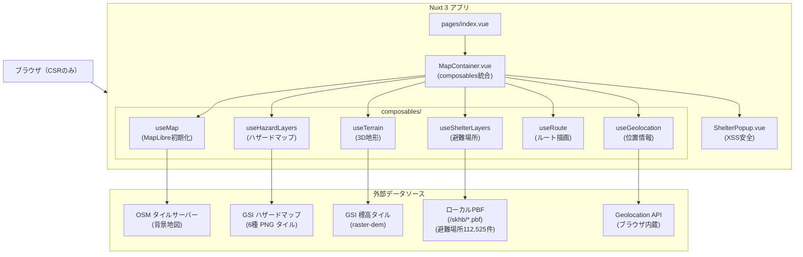

# nuxt-migration アーキテクチャ設計

**作成日**: 2026-04-20
**関連要件定義**: [requirements.md](../../spec/nuxt-migration/requirements.md)
**ヒアリング記録**: [design-interview.md](design-interview.md)

**【信頼性レベル凡例】**:
- 🔵 **青信号**: EARS要件定義書・設計文書・ユーザヒアリングを参考にした確実な設計
- 🟡 **黄信号**: EARS要件定義書・設計文書・ユーザヒアリングから妥当な推測による設計
- 🔴 **赤信号**: EARS要件定義書・設計文書・ユーザヒアリングにない推測による設計

---

## システム概要 🔵

**信頼性**: 🔵 *要件定義書 + ユーザーヒアリングより*

既存の防災マップPWA（Vanilla JavaScript SPA）をNuxt 3 + Vue 3 Composition APIに移行する。
バックエンドなし（静的ファイル配信）のクライアントサイドオンリー構成を維持しつつ、
コードをcomposables単位に分割して保守性を向上させる。

**変更点の概要**:
- フレームワーク: なし → Nuxt 3（CSRモード）
- 言語: JavaScript → TypeScript
- アーキテクチャ: 単一ファイル → composables + コンポーネント分割
- PWA: 手動実装 → @vite-pwa/nuxt
- 既知バグ（EDGE-101）とXSSリスクを同時修正

---

## アーキテクチャパターン 🔵

**信頼性**: 🔵 *ユーザーヒアリング + Nuxt 3の標準パターンより*

- **パターン**: CSRのみのSPA（ssr: false）+ Composable Architecture
- **選択理由**:
  - MapLibre GL JSはWebGL・window・documentを使用するためSSR不可
  - Composable Architectureにより機能ごとの責務分離と再利用性を実現
  - Nuxt 3はデフォルトでTypeScript対応・composablesの自動インポート

---

## コンポーネント構成

### Vueコンポーネント 🔵

**信頼性**: 🔵 *ユーザーヒアリング（標準Nuxt構造選択）より*

| コンポーネント | パス | 役割 |
|-------------|------|------|
| `MapContainer.vue` | `components/MapContainer.vue` | マップDOM領域 + 全composables初期化 + provide |
| `ShelterPopup.vue` | `components/ShelterPopup.vue` | 避難場所詳細ポップアップ（XSS安全） |
| `index.vue` | `pages/index.vue` | ルートページ（MapContainerを配置） |

### Composables 🔵

**信頼性**: 🔵 *ユーザーヒアリング（機能ユニット分割選択）より*

| Composable | パス | 責務 | 対応する既存コード |
|-----------|------|------|-----------------|
| `useMap` | `composables/useMap.ts` | MapLibre GL JS初期化・ライフサイクル管理 | main.js:15-32 |
| `useHazardLayers` | `composables/useHazardLayers.ts` | 6種ハザードマップレイヤー追加・OpacityControl | main.js:35-174 |
| `useShelterLayers` | `composables/useShelterLayers.ts` | 8種避難場所レイヤー・フィルター制御 | main.js:102-363 |
| `useGeolocation` | `composables/useGeolocation.ts` | GeolocateControl・userLocation状態管理 | main.js:418-425 |
| `useRoute` | `composables/useRoute.ts` | 最近傍計算・ルートライン描画（EDGE-101修正含む） | main.js:371-577 |
| `useTerrain` | `composables/useTerrain.ts` | GSI標高タイル・hillshade・TerrainControl | main.js:580-602 |

---

## ディレクトリ構造 🔵

**信頼性**: 🔵 *ユーザーヒアリング（Nuxt 3標準構造選択）より*

```
nuxt-map-app/
├── pages/
│   └── index.vue                  # ルートページ（MapContainerを配置）
├── components/
│   ├── MapContainer.vue            # マップ全体コンテナ（composables統合）
│   └── ShelterPopup.vue            # 避難場所ポップアップ（XSS安全）
├── composables/
│   ├── useMap.ts                   # マップ初期化・ライフサイクル
│   ├── useHazardLayers.ts          # ハザードマップレイヤー制御
│   ├── useShelterLayers.ts         # 避難場所レイヤー制御
│   ├── useGeolocation.ts           # 位置情報追跡
│   ├── useRoute.ts                 # 最近傍ルート描画（バグ修正済み）
│   └── useTerrain.ts               # 3D地形・陰影図
├── types/
│   └── index.ts                   # 全型定義（interfaces.tsから移行・拡張）
├── public/
│   ├── skhb/                      # 指定緊急避難場所ベクトルタイル（PBF）
│   │   ├── metadata.json
│   │   └── {z}/{x}/{y}.pbf
│   ├── icon192.png                 # PWAアイコン群
│   ├── icon256.png
│   ├── icon384.png
│   └── icon512.png
├── tests/
│   ├── unit/
│   │   ├── useRoute.test.ts        # getNearestFeature単体テスト（EDGE-101検証）
│   │   └── shelterPopup.test.ts    # ポップアップ表示テスト
│   └── e2e/
│       └── map-flow.spec.ts        # E2Eテスト（Playwright）
├── nuxt.config.ts                  # Nuxt設定（ssr: false, @vite-pwa/nuxt）
├── tsconfig.json                   # TypeScript設定（Nuxt自動生成）
└── package.json
```

---

## provide/inject によるマップインスタンス共有 🔵

**信頼性**: 🔵 *ユーザーヒアリング（provide/inject選択）より*

マップインスタンスはVueの provide/inject パターンで共有する。
`MapContainer.vue` がマップインスタンスを provide し、
各composableは inject でマップを参照する。

```typescript
// MapContainer.vue 側（provide）
const { map } = useMap('map-container')
provide('map', map)

// 各composable 側（inject）
// composablesはMapContainer.vueから呼ばれるので、
// MapContainer内でmap refをcomposableに渡す方式を採用
// （inject不要、引数として渡す）
```

**実装方針**: `MapContainer.vue` 内で `useMap()` を呼び、
返された `map` Refを各composableの引数として渡す。
シンプルなシングルページアプリのため、深いネストがなく
propsドリリング問題が発生しないため、引数渡しを採用。

---

## ShelterPopup のマウント方式 🔵

**信頼性**: 🔵 *ユーザーヒアリング（createApp方式選択）より*

MapLibre GL JSの `Popup.setDOMContent()` に `createApp` でVueコンポーネントをマウント。

```typescript
// useShelterLayers.ts または MapContainer.vue 内
import { createApp } from 'vue'
import ShelterPopup from '~/components/ShelterPopup.vue'

map.on('click', SKHB_LAYER_IDS, (e) => {
  const feature = e.features?.[0]
  if (!feature) return

  const container = document.createElement('div')
  const popup = new maplibregl.Popup()
    .setLngLat(e.lngLat)
    .setDOMContent(container)
    .addTo(map)

  // Vueコンポーネントをマウント
  const app = createApp(ShelterPopup, {
    properties: feature.properties as SkhbProperties
  })
  app.mount(container)

  // ポップアップ閉じた時にアンマウント
  popup.on('close', () => app.unmount())
})
```

---

## nuxt.config.ts の設計 🔵

**信頼性**: 🔵 *ユーザーヒアリング（標準設定選択）より*

```typescript
// nuxt.config.ts
export default defineNuxtConfig({
  ssr: false,                       // MapLibre SSR回避（REQ-002）

  modules: [
    '@vite-pwa/nuxt',               // PWA対応（REQ-080）
  ],

  pwa: {
    manifest: {
      name: '防災マップ',
      short_name: '防災マップ',
      display: 'standalone',
      background_color: '#ffffff',
      theme_color: '#3388ff',
      icons: [
        { src: 'icon192.png', sizes: '192x192', type: 'image/png' },
        { src: 'icon256.png', sizes: '256x256', type: 'image/png' },
        { src: 'icon384.png', sizes: '384x384', type: 'image/png' },
        { src: 'icon512.png', sizes: '512x512', type: 'image/png' },
      ],
    },
    workbox: {
      navigateFallback: '/',
      globPatterns: ['**/*.{js,css,html,png}'],
      // ベクトルタイルは容量大のためキャッシュ戦略を要検討
    },
  },

  typescript: {
    strict: true,                   // 厳密な型チェック
  },
})
```

---

## システム構成図 🔵

**信頼性**: 🔵 *要件定義・ユーザーヒアリングより*



---

## 非機能要件の実現方法

### パフォーマンス 🔵

**信頼性**: 🔵 *NFR-001・NFR-002より*

- **WebGLレンダリング**: MapLibre GL JSのGPUアクセラレーションを維持
- **ベクトルタイル**: 既存PBFを流用（Tippecanoe最適化済み、ズーム5〜8）
- **毎フレームルート計算**: `map.on('render')` 内で `querySourceFeatures` + `reduce`。Nuxt 3リアクティブシステムの過剰再描画を避けるため、composable内で `shallowRef` を活用

### セキュリティ 🔵

**信頼性**: 🔵 *NFR-101・NFR-102 + ユーザーヒアリングより*

- **XSS排除**: `ShelterPopup.vue` では `setHTML` を使用せず、Vue 3テンプレートの `{{ }}` バインディングのみ使用
- **位置情報非永続化**: `userLocation` はVue 3の `Ref<UserLocation>` としてメモリ内のみで管理、外部送信なし
- **createApp方式**: ポップアップにVueコンポーネントを独立アプリとしてマウントすることで、Vueのテンプレートコンパイルが自動エスケープを保証

### ユーザビリティ 🔵

**信頼性**: 🔵 *NFR-201・NFR-202より*

- **全画面マップ**: `MapContainer.vue` に `height: 100vh; width: 100vw;` を適用
- **スマートフォン対応**: `<meta name="viewport">` + PWAスタンドアロンモード
- **タッチ操作**: MapLibre GL JSのデフォルトタッチ操作をそのまま利用

### 運用性 🔵

**信頼性**: 🔵 *NFR-301 + ユーザーヒアリング（@vite-pwa/nuxt選択）より*

- **PWA**: `@vite-pwa/nuxt` によりService Workerを自動生成
- **キャッシュ戦略**: NavigateFallbackでオフライン起動対応
- **ベクトルタイルキャッシュ**: `public/skhb/` はビルド時にバンドルされるため事実上オフライン利用可能

---

## 技術的制約

### SSR禁止制約 🔵

**信頼性**: 🔵 *REQ-002・EDGE-201・EDGE-202より*

- `maplibregl` のインポートは必ず `onMounted` 内または `import()` で遅延ロード
- `window`, `document`, `WebGL` コンテキストはサーバー環境に存在しない
- `nuxt.config.ts` の `ssr: false` で全ページをCSRに強制

### Vanilla JSライブラリの互換性制約 🟡

**信頼性**: 🟡 *技術スタックから妥当な推測*

- `maplibre-gl-opacity`: Vanilla JS向けライブラリをそのまま使用。TypeScriptの型定義が不完全な可能性があり、`@types/maplibre-gl-opacity` が存在しない場合は手動型定義が必要
- `maplibre-gl-gsi-terrain`: 同様にVanilla JS向け。型定義に注意

### ベクトルタイルの静的配信 🔵

**信頼性**: 🔵 *既存実装から確実*

- `public/skhb/` のPBFファイル群（約100MB）はNuxtのビルド時に `dist/` にコピーされる
- `nuxt.config.ts` の追加設定不要（`public/` は自動的に静的ファイルとして扱われる）

---

## 関連文書

- **データフロー**: [dataflow.md](dataflow.md)
- **型定義**: [interfaces.ts](interfaces.ts)
- **ヒアリング記録**: [design-interview.md](design-interview.md)
- **要件定義**: [requirements.md](../../spec/nuxt-migration/requirements.md)
- **移行元アーキテクチャ**: [disaster-prevention-map/architecture.md](../disaster-prevention-map/architecture.md)

---

## 信頼性レベルサマリー

- 🔵 青信号: 14件 (87%)
- 🟡 黄信号: 2件 (13%)
- 🔴 赤信号: 0件 (0%)

**品質評価**: ✅ 高品質
