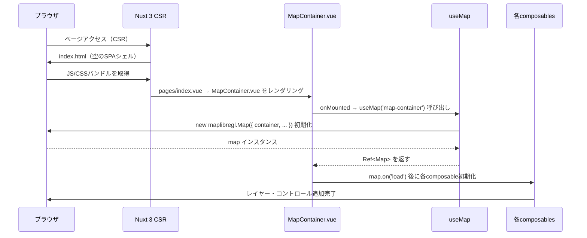
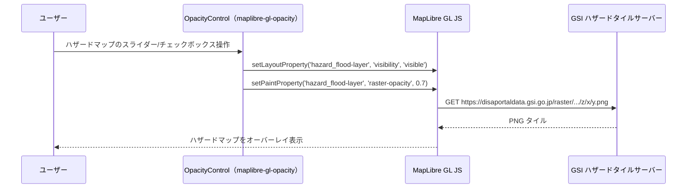
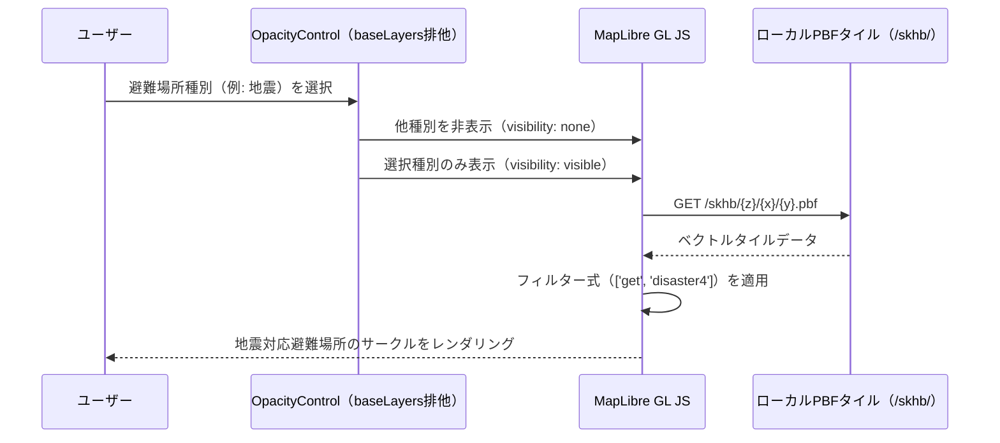
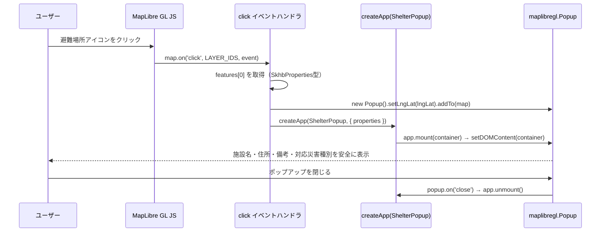
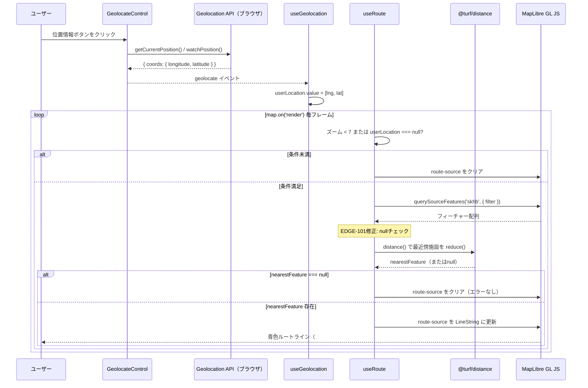
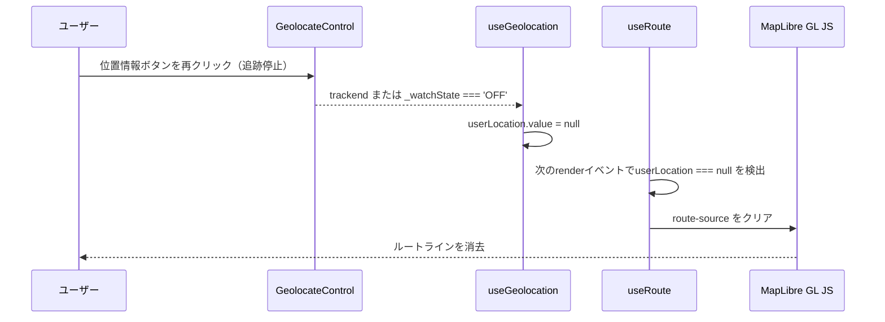
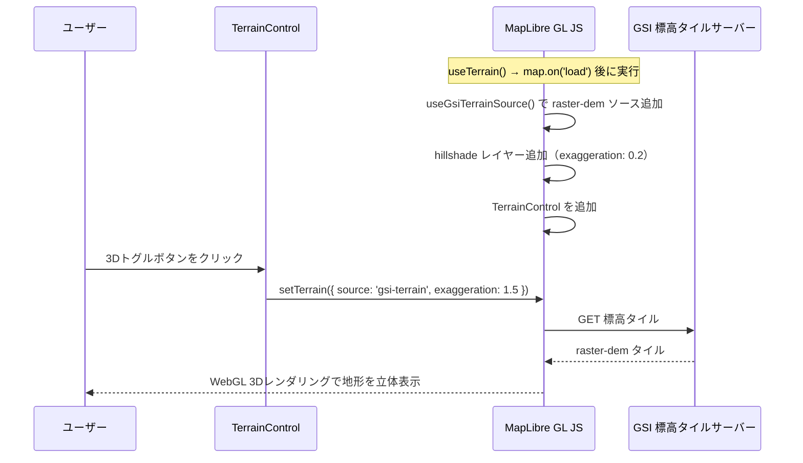
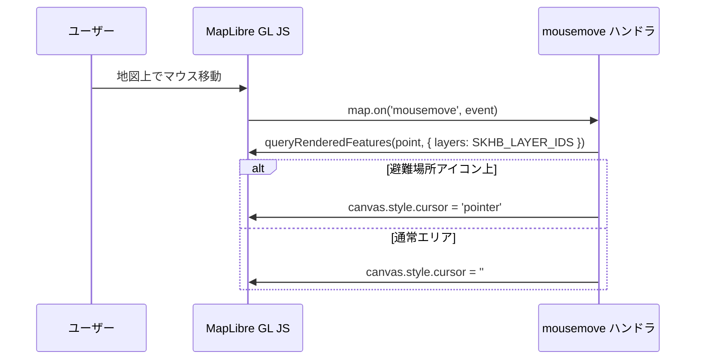
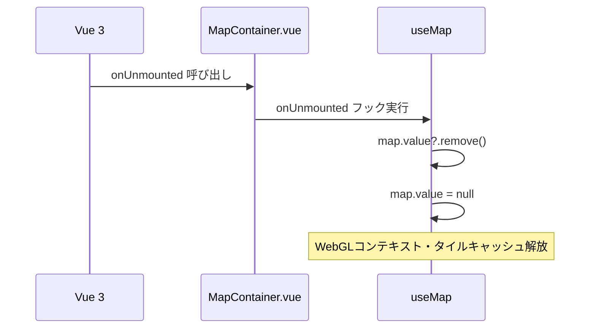
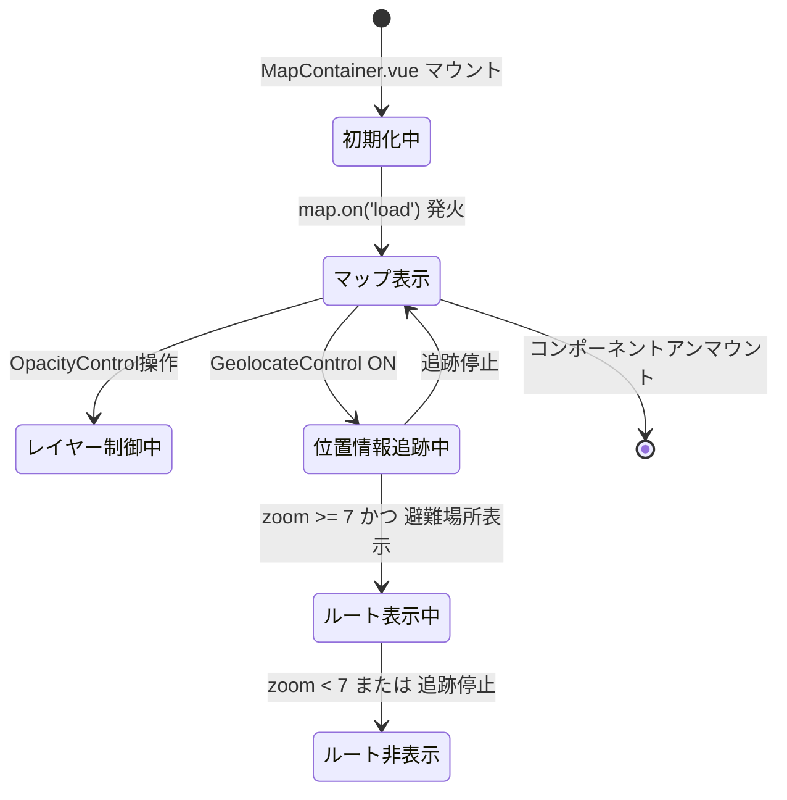

# nuxt-migration データフロー図

**作成日**: 2026-04-20
**関連アーキテクチャ**: [architecture.md](architecture.md)
**関連要件定義**: [requirements.md](../../spec/nuxt-migration/requirements.md)

**【信頼性レベル凡例】**:
- 🔵 **青信号**: EARS要件定義書・設計文書・ユーザヒアリングを参考にした確実なフロー
- 🟡 **黄信号**: EARS要件定義書・設計文書・ユーザヒアリングから妥当な推測によるフロー
- 🔴 **赤信号**: EARS要件定義書・設計文書・ユーザヒアリングにない推測によるフロー

---

## 1. アプリ起動・初期化フロー 🔵

**信頼性**: 🔵 *REQ-001, REQ-002, REQ-010 + アーキテクチャ設計より*



---

## 2. ハザードマップ表示フロー 🔵

**信頼性**: 🔵 *REQ-020, REQ-021 + 既存実装 main.js:35-174より*



**composable内の処理**:
```typescript
// useHazardLayers.ts 内の処理フロー
map.on('load', () => {
  // 1. ソース追加（6種）
  // 2. レイヤー追加（デフォルト visibility: 'none'）
  // 3. OpacityControl追加（position: 'top-left'）
})
```

---

## 3. 避難場所表示フロー 🔵

**信頼性**: 🔵 *REQ-030, REQ-031 + 既存実装 main.js:102-363より*



**getCurrentLayerFilter() の動作**:
```typescript
// useShelterLayers.ts内
function getCurrentLayerFilter(): FilterExpression | null {
  const visibleLayer = SKHB_LAYER_IDS.find(
    id => map.value?.getLayoutProperty(id, 'visibility') === 'visible'
  )
  if (!visibleLayer) return null
  const disasterNum = visibleLayer.match(/skhb-(\d+)-layer/)?.[1]
  return disasterNum ? ['get', `disaster${disasterNum}`] : null
}
```

---

## 4. 避難場所クリック → ポップアップ表示フロー（XSS修正済み） 🔵

**信頼性**: 🔵 *REQ-060, NFR-101 + ユーザーヒアリング（createApp方式）より*



**ShelterPopup.vue のテンプレート概要**:
```html
<!-- XSSリスクなし: {{ }} バインディングのみ使用 -->
<template>
  <div class="shelter-popup">
    <h3>{{ properties.name }}</h3>
    <p>{{ properties.address }}</p>
    <p v-if="properties.remarks">{{ properties.remarks }}</p>
    <ul>
      <li v-for="i in 8" :key="i"
          :class="{ disabled: !properties[`disaster${i}`] }">
        {{ DISASTER_LABELS[i] }}
      </li>
    </ul>
  </div>
</template>
```

---

## 5. 位置情報取得 → ルート描画フロー（EDGE-101バグ修正済み） 🔵

**信頼性**: 🔵 *REQ-040, REQ-050, REQ-051, REQ-052 + ユーザーヒアリング（EDGE-101修正）より*



**EDGE-101修正のコード**:
```typescript
// useRoute.ts 内
map.on('render', () => {
  if (map.getZoom() < 7 || !userLocation.value) {
    clearRoute()
    return
  }
  const features = map.querySourceFeatures('skhb', { filter: getCurrentLayerFilter() })
  const nearestFeature = getNearestFeature(userLocation.value, features)

  // ← EDGE-101修正: null チェック追加
  if (!nearestFeature) {
    clearRoute()
    return
  }

  drawRoute(userLocation.value, nearestFeature.geometry.coordinates)
})
```

---

## 6. 位置情報追跡停止フロー 🔵

**信頼性**: 🔵 *REQ-040, REQ-102（元REQ-102）+ 既存実装 main.js:545-546より*



---

## 7. 3D地形表示フロー 🔵

**信頼性**: 🔵 *REQ-070 + 既存実装 main.js:580-602より*



---

## 8. カーソル変更フロー 🔵

**信頼性**: 🔵 *REQ-061 + 既存実装 main.js:519-540より*



---

## 9. アプリ終了・クリーンアップフロー 🔵

**信頼性**: 🔵 *EDGE-202 + Vue 3 composablesのベストプラクティスより*



---

## データ処理パターン

### 同期処理 🔵

**信頼性**: 🔵 *アーキテクチャ設計より*

- マップ初期化（`new maplibregl.Map()`）
- レイヤー追加・設定変更
- ポップアップ表示

### 非同期処理（タイル取得） 🔵

**信頼性**: 🔵 *MapLibre GL JS の内部動作より*

- タイルの取得はMapLibre GL JSが内部で非同期管理（開発者が意識する必要なし）
- `map.on('load')` で全レイヤーの初期化完了を検出

### 毎フレーム処理 🔵

**信頼性**: 🔵 *REQ-050 + 既存実装 main.js:542-577より*

- `map.on('render')` でルート計算を毎フレーム実行
- 軽量に保つため `querySourceFeatures` の結果を最小限に絞る（filter適用）

---

## 状態管理フロー

### Vueリアクティブ状態 🔵

**信頼性**: 🔵 *ユーザーヒアリング + Vue 3 Composition APIより*



### 状態変数一覧 🔵

**信頼性**: 🔵 *要件定義 + 既存実装の状態管理パターンより*

| 変数 | 型 | 管理場所 | 説明 |
|-----|-----|---------|------|
| `map` | `Ref<maplibregl.Map \| null>` | `useMap` | マップインスタンス |
| `userLocation` | `Ref<UserLocation>` | `useGeolocation` | 現在地座標（null=未取得） |
| レイヤーvisibility | MapLibre内部状態 | MapLibre GL JS | 各レイヤーの表示/非表示 |
| レイヤーopacity | MapLibre内部状態 | MapLibre GL JS | 各レイヤーの不透明度 |

**設計方針**: アプリケーション状態は最小限のVue Refと MapLibre GL JSの内部状態で管理。
Piniaは導入しない（シングルページアプリで不要なため）。

---

## 関連文書

- **アーキテクチャ**: [architecture.md](architecture.md)
- **型定義**: [interfaces.ts](interfaces.ts)
- **要件定義**: [requirements.md](../../spec/nuxt-migration/requirements.md)
- **移行元データフロー**: [../disaster-prevention-map/dataflow.md](../disaster-prevention-map/dataflow.md)

---

## 信頼性レベルサマリー

- 🔵 青信号: 9件 (100%)
- 🟡 黄信号: 0件 (0%)
- 🔴 赤信号: 0件 (0%)

**品質評価**: ✅ 高品質
