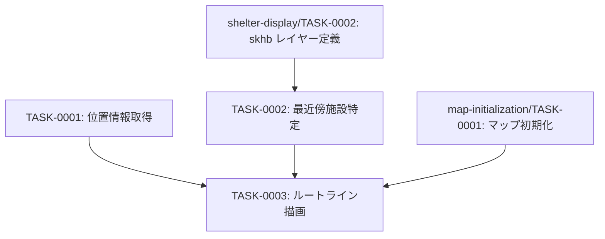

# geolocation-routing タスク一覧

## 概要

**分析日時**: 2026-04-20  
**対象コードベース**: `03_advanced_with_tsumiki/main.js`  
**発見タスク数**: 3  
**推定総工数**: 4時間

ユーザーの現在地取得と、現在表示中の災害種別に対応した最寄り指定緊急避難場所への直線ルート描画機能。

---

## タスク一覧

### TASK-0001: 位置情報取得コントロール

- [x] **タスク完了**（実装済み）
- **タスクタイプ**: DIRECT
- **実装ファイル**:
  - `main.js:418-425`
- **実装詳細**:
  - `maplibregl.GeolocateControl`（`trackUserLocation: true`）で継続的に位置情報を追跡
  - `geolocate` イベントで `userLocation` 変数を `[lng, lat]` に更新
  - コントロール配置: 右下（`bottom-right`）
- **推定工数**: 1時間

### TASK-0002: 最近傍避難場所の特定

- [x] **タスク完了**（実装済み）
- **タスクタイプ**: DIRECT
- **実装ファイル**:
  - `main.js:371-413`
- **実装詳細**:
  - `getCurrentSkhbLayerFilter()`: 表示中 skhb レイヤーの filter 条件を動的取得
  - `getNearestFeature()`: `querySourceFeatures` + `@turf/distance` で最近傍施設を特定
  - `reduce()` で全施設を走査し最小距離のフィーチャーを返却
  - **既知のバグリスク**: 取得フィーチャーが0件の場合 `null` を返し、後続処理でエラーが発生する可能性（`main.js:568`）
- **推定工数**: 2時間

### TASK-0003: 現在地〜最寄り施設のルートライン描画

- [x] **タスク完了**（実装済み）
- **タスクタイプ**: DIRECT
- **実装ファイル**:
  - `main.js:116-123`（route ソース定義）
  - `main.js:176-185`（route-layer 定義）
  - `main.js:542-577`（render イベントでのルート更新）
- **実装詳細**:
  - GeoJSON LineString で現在地〜最寄り施設を接続
  - 毎フレーム（`map.on('render')`）でルートデータを更新
  - ズームレベル < 7 または位置情報未取得の場合はルートをクリア
  - GeolocateControl が OFF の場合も userLocation を null にリセット
  - ラインスタイル: `#33aaff`、幅4px
- **推定工数**: 1時間

---

## 依存関係マップ

---

## 技術的負債・注意点

- **バグリスク**: `main.js:568` — `nearestFeature._geometry.coordinates` の参照。`getNearestFeature()` が `null` を返した場合（避難場所フィーチャーが0件）にTypeErrorが発生する可能性がある。null チェックの追加が推奨される。
- **パフォーマンス**: `map.on('render')` は毎フレーム発火するため、`querySourceFeatures` が重い場合はフレームレートに影響が出る可能性がある。
