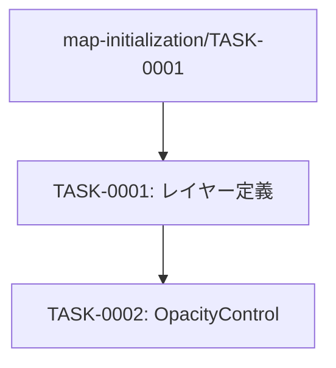

# hazard-map-overlay タスク一覧

## 概要

**分析日時**: 2026-04-20  
**対象コードベース**: `03_advanced_with_tsumiki/main.js`  
**発見タスク数**: 2  
**推定総工数**: 2時間

国土地理院提供のハザードマップ（6種）をラスタータイルとして地図に重ね合わせる機能。

---

## タスク一覧

### TASK-0001: ハザードマップレイヤー定義

- [x] **タスク完了**（実装済み）
- **タスクタイプ**: DIRECT
- **実装ファイル**:
  - `main.js:35-100`（ソース定義）
  - `main.js:133-174`（レイヤー定義）
- **実装詳細**:
  - 6種のハザードマップをラスタータイルソースとして定義
  - 各レイヤーは `raster-opacity: 0.7`、`visibility: 'none'`（初期非表示）
  - GSI ディザスターポータルからのタイル配信（z=2〜17）
- **推定工数**: 1時間

### TASK-0002: ハザードマップ表示コントロール（OpacityControl）

- [x] **タスク完了**（実装済み）
- **タスクタイプ**: DIRECT
- **実装ファイル**:
  - `main.js:430-440`
- **実装詳細**:
  - `maplibre-gl-opacity` プラグインで左上にコントロールを配置
  - 6種のレイヤーを日本語ラベル付きで表示/非表示・不透明度制御
  - ラベル: 洪水浸水想定区域、高潮浸水想定区域、津波浸水想定区域、土石流警戒区域、急傾斜警戒区域、地滑り警戒区域
- **推定工数**: 1時間

---

## 依存関係マップ

