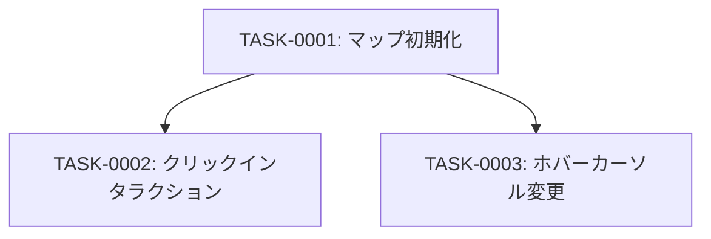

# map-initialization タスク一覧

## 概要

**分析日時**: 2026-04-20  
**対象コードベース**: `03_advanced_with_tsumiki/main.js`  
**発見タスク数**: 3  
**推定総工数**: 4時間

MapLibre GL JS を用いた地図の初期化と、基本インタラクション（クリック・ホバー）の実装。

---

## タスク一覧

### TASK-0001: MapLibre GL JS マップ初期化

- [x] **タスク完了**（実装済み）
- **タスクタイプ**: DIRECT
- **実装ファイル**:
  - `main.js:1-366`
- **実装詳細**:
  - MapLibre GL JS のマップインスタンス生成（container, zoom, center, minZoom, maxZoom, maxBounds）
  - 初期中心: 経度138°、緯度37°（日本中央部）
  - ズーム範囲: 5〜18
  - 表示範囲制限: 経度122〜154°、緯度20〜50°（日本国内）
  - 背景地図ソース（OSM ラスタータイル）の定義
  - 全ソース・レイヤーのスタイル定義（inline style オブジェクト）
- **推定工数**: 2時間

### TASK-0002: 避難場所クリックインタラクション

- [x] **タスク完了**（実装済み）
- **タスクタイプ**: DIRECT
- **実装ファイル**:
  - `main.js:458-516`
- **実装詳細**:
  - `map.on('click')` イベントで避難場所レイヤー上のフィーチャーを検出
  - `queryRenderedFeatures` で8種の skhb レイヤーを対象に検索
  - フィーチャーが存在する場合、`maplibregl.Popup` でポップアップ表示
  - 表示内容: 名称（太字）、住所、備考（null対応）、8種の災害対応状況（灰色/通常色）
  - 最大幅400pxのポップアップ
- **推定工数**: 1時間

### TASK-0003: ホバー時カーソル変更

- [x] **タスク完了**（実装済み）
- **タスクタイプ**: DIRECT
- **実装ファイル**:
  - `main.js:519-540`
- **実装詳細**:
  - `map.on('mousemove')` で避難場所レイヤー上のフィーチャーを検出
  - フィーチャー有: `cursor = 'pointer'`、フィーチャー無: `cursor = ''`
- **推定工数**: 1時間

---

## 依存関係マップ

