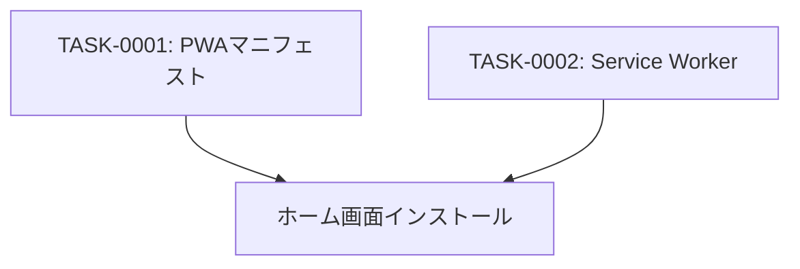

# pwa-setup タスク一覧

## 概要

**分析日時**: 2026-04-20  
**対象コードベース**: `03_advanced_with_tsumiki/`  
**発見タスク数**: 2  
**推定総工数**: 1時間

Progressive Web App（PWA）として動作するための設定。ホーム画面インストールとオフライン起動対応。

---

## タスク一覧

### TASK-0001: PWAマニフェスト設定

- [x] **タスク完了**（実装済み）
- **タスクタイプ**: DIRECT
- **実装ファイル**:
  - `public/manifest.json`
  - `index.html`（manifest リンク）
  - `public/icon192.png`, `icon256.png`, `icon384.png`, `icon512.png`
- **実装詳細**:
  - PWAマニフェスト定義（name: 防災マップ、display: standalone）
  - 4種サイズのアイコン（192, 256, 384, 512px）
  - テーマカラー・背景色: `#2185f3`（青系）
  - `start_url: './'`, `scope: './'`（相対パスでデプロイ先依存なし）
- **推定工数**: 0.5時間

### TASK-0002: Service Worker 設定（最小実装）

- [x] **タスク完了**（最小実装）
- **タスクタイプ**: DIRECT
- **実装ファイル**:
  - `public/sw.js`
  - `index.html`（登録スクリプト）
- **実装詳細**:
  - Service Worker ファイルは存在するが fetch イベントハンドラーは未実装（空のみ）
  - `index.html` でのSW登録スクリプトにより、PWAとして認識される
  - **オフラインキャッシュは実質的に機能していない**（要対応）
- **推定工数**: 0.5時間

---

## 依存関係マップ

---

## 技術的負債

- **Service Worker が最小実装**: `sw.js` に fetch ハンドリングがないため、オフライン環境では外部タイルサーバーへのアクセスが失敗する。キャッシュ戦略（Cache First 等）の実装が必要。
