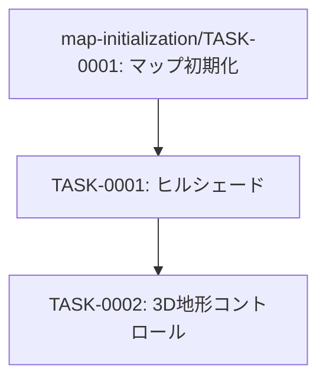

# terrain-visualization タスク一覧

## 概要

**分析日時**: 2026-04-20  
**対象コードベース**: `03_advanced_with_tsumiki/main.js`  
**発見タスク数**: 2  
**推定総工数**: 2時間

国土地理院標高タイルを用いた陰影図（ヒルシェード）および3D地形表示機能。

---

## タスク一覧

### TASK-0001: 陰影図（ヒルシェード）表示

- [x] **タスク完了**（実装済み）
- **タスクタイプ**: DIRECT
- **実装ファイル**:
  - `main.js:580-595`
- **実装詳細**:
  - `maplibre-gl-gsi-terrain` プラグインで標高タイルソースを生成
  - `map.addSource('terrain', gsiTerrainSource)` で raster-dem ソースを追加
  - `hillshade` レイヤーを追加（`hillshade-exaggeration: 0.2`）
  - `hazard_jisuberi-layer` の手前に挿入（レイヤー順序制御）
  - 常時表示（toggleなし）
- **推定工数**: 1時間

### TASK-0002: 3D地形コントロール

- [x] **タスク完了**（実装済み）
- **タスクタイプ**: DIRECT
- **実装ファイル**:
  - `main.js:597-602`
- **実装詳細**:
  - `maplibregl.TerrainControl`（`source: 'terrain'`, `exaggeration: 1`）を追加
  - ユーザーがON/OFFで3D地形と平面地図を切り替え可能
  - `maplibre-gl-gsi-terrain` のプロトコル登録後に初期化
- **推定工数**: 1時間

---

## 依存関係マップ

