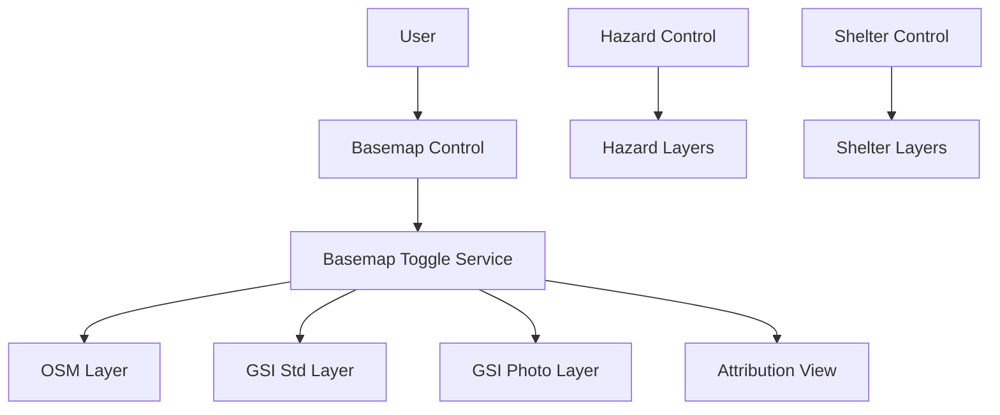
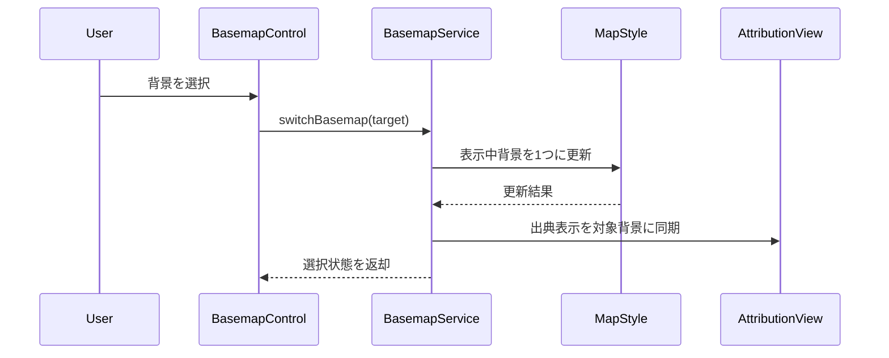

## Overview
本設計は、防災マップに背景地図切り替え機能を追加し、利用者が表示目的に応じて OpenStreetMap・地理院地図・航空写真を切り替えられるようにする。既存機能（ハザード表示、避難施設表示、現在地導線）を継続動作させることを前提に、背景表示責務のみを拡張する。

本機能の利用者は地図閲覧者であり、主なワークフローは「左下コントロールで背景選択 → 背景更新 → 他機能継続確認」である。単一エントリ構成の既存方針を維持し、`main.js` 内の style/source/layer 管理と control 追加点に限定して変更する。

### Goals
- 背景地図3種の排他的切替を提供する
- 既存表示機能の状態を保持したまま切替可能にする
- 表示中背景に対応した出典情報を可視化する

### Non-Goals
- ハザード/避難施設/ルーティングのロジック変更
- 3D地形処理の変更
- オフラインタイル配信機能の導入

## Boundary Commitments

### This Spec Owns
- 背景地図候補の定義（3種類）
- 背景切替UIの表示と選択状態表示
- 背景レイヤーの排他表示制御
- 背景切替に連動した出典表示と失敗時の利用者可視化

### Out of Boundary
- ハザードオーバーレイコントロールの仕様変更
- 避難施設レイヤー・フィルタ仕様の変更
- 位置情報追跡/最寄り施設計算の仕様変更
- タイル提供元の可用性保証・配信基盤再設計

### Allowed Dependencies
- `maplibre-gl` の style/source/layer/control API
- 既存 `maplibre-gl-opacity` コントロールとの共存
- OSM標準タイルおよび地理院標準地図・写真タイル
- 既存 SPA 構成（Vite + `main.js` 集約）

### Revalidation Triggers
- 背景レイヤーID・sourceID・選択値の契約変更
- 出典表示文言または表示位置の仕様変更
- コントロール配置（左下）の変更
- 背景切替と既存機能の同時利用条件の変更

## Architecture

### Existing Architecture Analysis (if applicable)
- 既存マップは `main.js` で style を一括定義し、`map.on('load')` でコントロールとイベントを追加する
- 背景地図は `osm-layer` のみ常時表示
- 既存コントロールは左上（ハザード）・右上（避難施設）・右下（現在地）を利用済み

### Architecture Pattern & Boundary Map
**Architecture Integration**:
- Selected pattern: 既存 style 拡張 + 排他レイヤー切替
- Domain/feature boundaries: 背景切替責務を Basemap 定義/切替制御/UI 表示に限定
- Existing patterns preserved: source/layer宣言・visibility制御・load時コントロール追加
- New components rationale: 切替責務を独立させ既存機能への副作用を局所化
- Steering compliance: 単一エントリ構成と既存命名規約を維持



### Technology Stack

| Layer | Choice / Version | Role in Feature | Notes |
|-------|------------------|-----------------|-------|
| Frontend / CLI | JavaScript (ESM) | 背景切替UIと状態制御 | 既存構成を維持 |
| Backend / Services | N/A | なし | クライアント完結 |
| Data / Storage | Raster tile endpoints | 背景地図データ取得 | OSM/GSI 利用条件順守 |
| Messaging / Events | MapLibre event model | UI操作と地図状態同期 | `load` 後に有効化 |
| Infrastructure / Runtime | Vite 3 + Browser | 実行基盤 | SPA |

## File Structure Plan

### Directory Structure
```
/
├── main.js      # 地図スタイル定義、背景切替サービス、コントロール登録
├── style.css    # 背景切替コントロールの見た目と狭画面調整
└── index.html   # 既存エントリ（機能追加では原則変更なし）
```

### Modified Files
- `main.js` — 背景source/layer追加、排他切替ロジック、左下コントロール、出典表示同期、失敗時表示
- `style.css` — 背景切替UIのレイアウト・選択状態・狭画面時の表示制約
- `index.html` — 必要時のみコントロール表示に関わる最小マークアップ補助

## System Flows



## Requirements Traceability

| Requirement | Summary | Components | Interfaces | Flows |
|-------------|---------|------------|------------|-------|
| 1.1 | 左下に切替UIを表示 | BasemapControl | State | System Flow |
| 1.2 | 3種類を選択可能 | BasemapCatalog | State | - |
| 1.3 | 選択背景を表示 | BasemapToggleService | Service | System Flow |
| 1.4 | 背景は常に1種類 | BasemapToggleService | Service | System Flow |
| 1.5 | 無効操作時に維持 | BasemapToggleService | Service | System Flow |
| 2.1 | ハザード表示維持 | BasemapToggleService | Service | System Flow |
| 2.2 | 避難施設表示維持 | BasemapToggleService | Service | System Flow |
| 2.3 | 現在地連動表示継続 | BasemapToggleService | Service | System Flow |
| 2.4 | 再読み込みなし継続操作 | BasemapControl | State | System Flow |
| 3.1 | 識別可能な名称表示 | BasemapControl | State | - |
| 3.2 | 選択中状態の視覚区別 | BasemapControl | State | - |
| 3.3 | 狭画面で閲覧阻害しない | BasemapControlStyle | State | - |
| 4.1 | 表示中背景の出典表示 | AttributionPresenter | State | System Flow |
| 4.2 | 切替時に出典更新 | AttributionPresenter | Service/State | System Flow |
| 4.3 | 表示失敗時の判別可能表示 | BasemapErrorPresenter | State | System Flow |

## Components and Interfaces

| Component | Domain/Layer | Intent | Req Coverage | Key Dependencies (P0/P1) | Contracts |
|-----------|--------------|--------|--------------|--------------------------|-----------|
| BasemapCatalog | Config | 背景候補の正規定義 | 1.2, 4.1, 4.2 | Map style source/layer (P0) | State |
| BasemapToggleService | Logic | 背景の排他切替と非回帰維持 | 1.3, 1.4, 1.5, 2.1, 2.2, 2.3 | MapLibre API (P0) | Service |
| BasemapControl | UI | 左下UIと選択状態表示 | 1.1, 2.4, 3.1, 3.2, 3.3 | BasemapToggleService (P0) | State |
| AttributionPresenter | UI | 背景連動の出典表示 | 4.1, 4.2 | BasemapCatalog (P0) | State |
| BasemapErrorPresenter | UI | 背景表示失敗の可視化 | 4.3 | BasemapToggleService (P1) | State |

### Map Runtime Layer

#### BasemapToggleService

| Field | Detail |
|-------|--------|
| Intent | 背景地図レイヤーを排他制御し、既存機能状態を維持する |
| Requirements | 1.3, 1.4, 1.5, 2.1, 2.2, 2.3 |

**Responsibilities & Constraints**
- 背景レイヤー可視状態を1つに保つ
- ハザード/避難施設/現在地系レイヤーの状態を変更しない
- 無効入力では状態不変を保証する

**Dependencies**
- Inbound: BasemapControl — 利用者操作受付 (P0)
- Outbound: MapLibre Map instance — layout visibility 更新 (P0)
- External: OSM/GSI tile endpoints — 背景タイル表示 (P1)

**Contracts**: Service [x] / API [ ] / Event [ ] / Batch [ ] / State [x]

##### Service Interface
```typescript
interface BasemapToggleService {
  switchBasemap(target: BasemapId): BasemapSwitchResult;
  getCurrentBasemap(): BasemapId;
}

type BasemapId = 'osm' | 'gsiStd' | 'gsiPhoto';

type BasemapSwitchResult = {
  changed: boolean;
  current: BasemapId;
  reason?: 'invalid-target' | 'layer-not-ready' | 'render-failed';
};
```
- Preconditions: マップロード完了後に呼び出される
- Postconditions: 背景レイヤー可視状態は最大1つ
- Invariants: 非背景レイヤーの visibility を変更しない

**Implementation Notes**
- Integration: 既存 `map.on('load')` 初期化順序に従って登録
- Validation: 切替前後で `hazard_*`, `skhb-*`, `route-layer` の状態差分を監視
- Risks: source未初期化時の切替失敗

#### BasemapControl

| Field | Detail |
|-------|--------|
| Intent | 左下に背景切替UIを表示し選択状態を明示 |
| Requirements | 1.1, 2.4, 3.1, 3.2, 3.3 |

**Responsibilities & Constraints**
- 3選択肢を識別可能名称で表示
- 選択中項目を視覚的に区別
- 狭画面で地図閲覧を阻害しない表示密度を維持

**Dependencies**
- Inbound: User interaction (P0)
- Outbound: BasemapToggleService (P0)
- External: MapLibre control container (P1)

**Contracts**: Service [ ] / API [ ] / Event [ ] / Batch [ ] / State [x]

**Implementation Notes**
- Integration: 既存左上/右上コントロールと重ならない左下配置
- Validation: 主要画面幅で重なり・タップ不能がないこと
- Risks: 小画面での視認性低下

#### AttributionPresenter / BasemapErrorPresenter

| Field | Detail |
|-------|--------|
| Intent | 背景連動出典表示と失敗時判別可能表示 |
| Requirements | 4.1, 4.2, 4.3 |

**Responsibilities & Constraints**
- 表示中背景に対応した出典を常時可視
- 背景切替と同時に出典を更新
- 背景表示失敗時に利用者が判別できる文言/状態を提示

**Dependencies**
- Inbound: BasemapToggleService result (P0)
- Outbound: UI text region in map container (P1)
- External: tile loading outcome (P1)

**Contracts**: Service [ ] / API [ ] / Event [ ] / Batch [ ] / State [x]

**Implementation Notes**
- Integration: MapLibre attribution表示と競合しない配置
- Validation: 背景別出典文言の一致確認
- Risks: 背景種別追加時の文言未更新

## Data Models

### Domain Model
- Basemap: `id`, `label`, `sourceId`, `layerId`, `attributionText`
- BasemapSelectionState: `currentBasemap`, `availableBasemaps`, `lastError`

### Logical Data Model
- 背景候補は固定長コレクション（3件）
- `currentBasemap` は候補集合のいずれか1件
- `lastError` は表示失敗時のみセットされる任意値

### Data Contracts & Integration
- UI入力: `BasemapId`
- 切替結果: `BasemapSwitchResult`
- 出典表示入力: `BasemapId` -> `attributionText`

## Error Handling

### Error Strategy
- 無効選択: 現在背景維持 + 操作無効を非破壊で扱う
- 表示失敗: 利用者判別可能な失敗状態を提示し、前回背景を維持

### Error Categories and Responses
- **User Errors**: 無効選択値は状態変更なし
- **System Errors**: タイル取得失敗時は失敗表示を提示し地図操作継続
- **Business Logic Errors**: 背景候補未定義は切替不成立

### Monitoring
- 切替操作回数・失敗回数・失敗理由を開発時ログで観測可能にする

## Testing Strategy

### Unit Tests
- 1.3/1.4: 切替後に可視背景が1件のみになる
- 1.5: 無効選択で `currentBasemap` が不変
- 4.2: 切替結果に応じて出典表示値が更新される

### Integration Tests
- 2.1: 背景切替前後でハザード表示状態が維持される
- 2.2: 背景切替前後で避難施設表示状態が維持される
- 2.3: 現在地追跡中に背景切替してもルート表示が継続する
- 4.3: タイル表示失敗時に判別可能表示が出る

### E2E/UI Tests (if applicable)
- 1.1/3.1: 左下UI表示と3選択肢名称の可視確認
- 3.2: 選択中項目の視覚差を確認
- 3.3: 狭画面で地図操作を阻害しないことを確認
- 2.4: 背景切替時に再読み込みなしで操作継続できる

### Performance/Load (if applicable)
- 背景切替連打時のUI応答遅延が顕著でないこと
- 背景切替で操作不能状態に陥らないこと

## Security Considerations
- 外部タイルURLは固定許可リスト（OSM/GSI）に限定する
- 出典表示を隠蔽しない

## Performance & Scalability
- 背景候補を3件に限定し、不要な再初期化を避ける
- 高頻度切替でも既存描画ループへ過剰負荷を与えない
