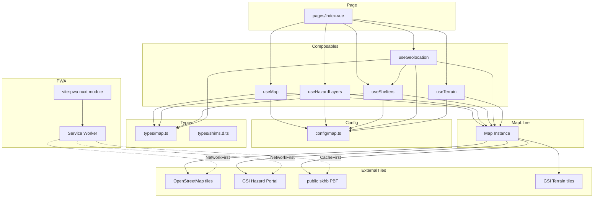
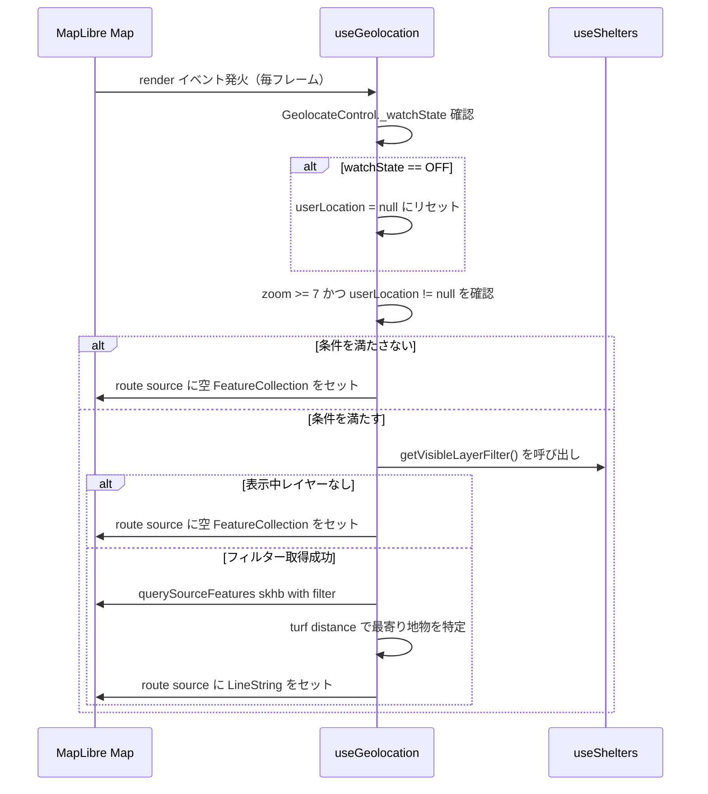
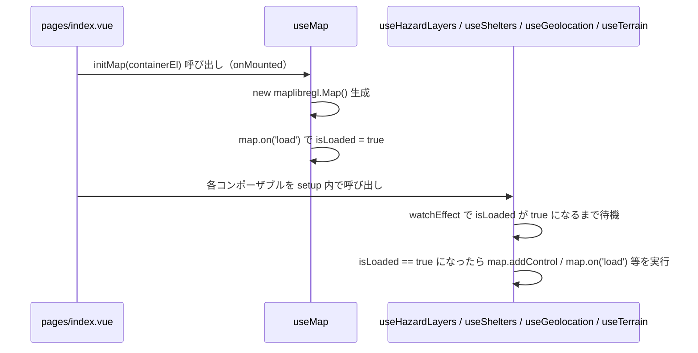
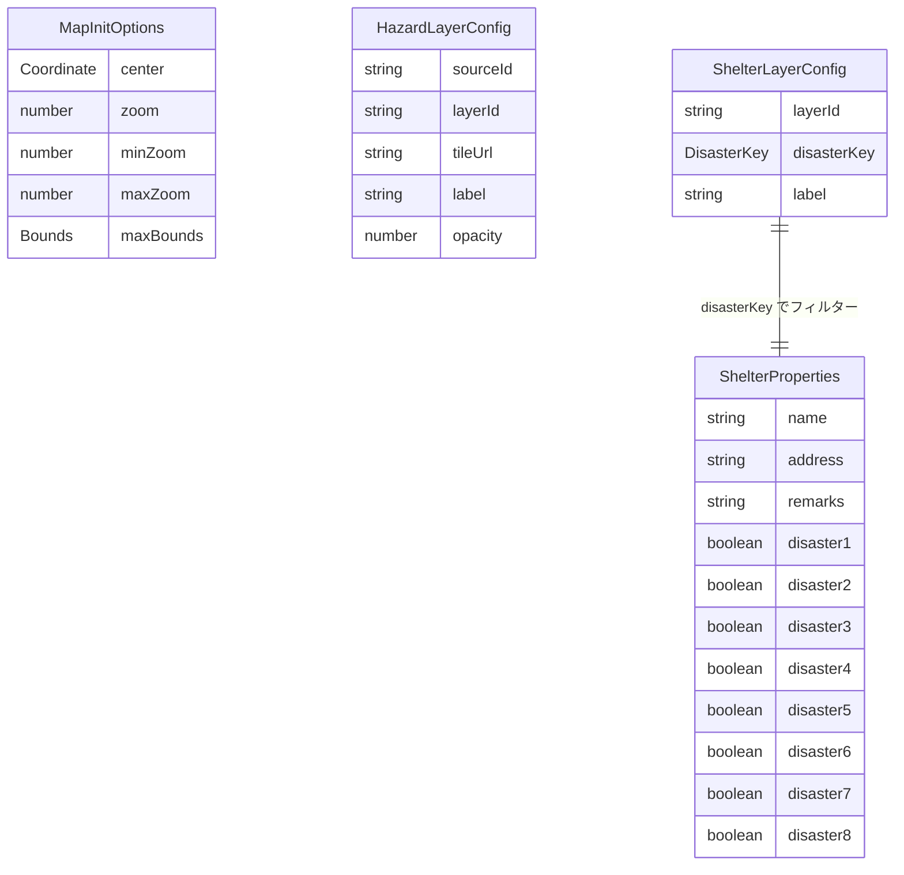

# 技術設計書: hazard-map-app

## Overview

本フィーチャーは、既存のバニラ JS ハザードマップアプリ（`main.js` 単一ファイル、603 行）を Nuxt 3 ベースのコンポーザブル構成へ全面移行し、位置情報エンジニア向けの参照実装としての価値を維持しながら TypeScript・PWA・テスト容易性を実現する。

**Purpose**: 地図表示・ハザードオーバーレイ・避難場所フィルタリング・GPS ルート・3D 地形・PWA オフライン対応の全機能を、Nuxt 3 のコンポーザブル分割構成で再実装する。  
**Users**: 地図オーバーレイ・ベクトルタイル・位置情報 API を学ぶ位置情報エンジニアが、Nuxt 移行の参照実装として活用する。  
**Impact**: モノリシック `main.js` を廃止し、`nuxt-map-app/` ワークスペースに機能・レイヤーベースの構成を新設する。既存バニラ JS 実装は変更しない。

### Goals

- 全 6 要件（ベース地図・ハザードオーバーレイ・避難場所・GPS ルート・3D 地形・PWA）を Nuxt 3 で同等に実現する
- TypeScript による型安全性を確立し、GAP-3 を解消する
- `@vite-pwa/nuxt` の Workbox キャッシュ戦略で Service Worker を本格実装し、GAP-1 を解消する
- コンポーザブル分割による関心の分離で GAP-4 を解消し、テスト容易性を確保する

### Non-Goals

- バックエンド API・ユーザー認証・リアルタイム災害情報
- 避難経路のルーティング計算（直線距離のみ）
- SSR / SSG によるサーバーサイドレンダリング（地図ページは CSR 専用）
- `map render` 毎フレーム再計算の最適化（現行動作を維持）
- 既存バニラ JS ファイル（`main.js`・`index.html`）の変更

---

## Boundary Commitments

### This Spec Owns

- `nuxt-map-app/` ディレクトリの新規作成と全ファイル
- Nuxt 3 アプリケーション設定（`nuxt.config.ts`）
- MapLibre GL JS の初期化・レイヤー管理・イベントハンドリングの全ロジック
- `@vite-pwa/nuxt` によるキャッシュ戦略・マニフェスト設定
- TypeScript 型定義（`types/map.ts`・`types/shims.d.ts`）
- SKHB ベクトルタイル（`public/skhb/`）の Nuxt public ディレクトリへのコピー

### Out of Boundary

- 既存バニラ JS ファイル（`main.js`・`index.html`・`style.css`・`public/sw.js`）への変更
- 外部タイルサービス（OSM・ハザードポータル・地理院）の可用性管理
- Vitest / Playwright のテスト実装（タスクとして別途定義するが本設計書の範囲外）

### Allowed Dependencies

- `maplibre-gl` v2.4.x（既存バージョンを踏襲）
- `maplibre-gl-opacity` v1.4.x
- `@turf/distance` v6.5.x
- `maplibre-gl-gsi-terrain` v0.0.2
- `@vite-pwa/nuxt`（新規追加）
- Nuxt 3 / Vue 3 / TypeScript

### Revalidation Triggers

- `ShelterProperties` の属性定義変更（disaster1〜8 のスキーマ変更）
- MapLibre GL JS のメジャーバージョンアップ（API 互換性に影響）
- SKHB ベクトルタイルのスキーマ変更
- `@vite-pwa/nuxt` のキャッシュ戦略設定変更

---

## Architecture

### Existing Architecture Analysis

現行実装の制約と引き継ぐパターン：

- **単一ファイルモノリス**: `main.js` がソース定義・レイヤー定義・コントロール・イベントハンドラーを全て包含。Nuxt 移行では関心ごとにコンポーザブルへ分割する。
- **宣言的スタイルオブジェクト**: `new maplibregl.Map({ style: { sources, layers } })` でソース・レイヤーを初期化時に一括定義するパターンは維持する。
- **グローバル状態は `userLocation` のみ**: Vue の `Ref<Coordinate | null>` に変換し `useGeolocation` コンポーザブルに閉じ込める。
- **`map render` イベントによるルート更新**: 毎フレーム再計算パターンは現行通り維持する。
- **OpacityControl の制御モデル**: `layout.visibility`（`visible`/`none`）で管理し DOM 操作を行わないパターンを維持する。

### Architecture Pattern & Boundary Map

依存方向: `Types` → `Config` → `Composables` → `Page`（右から左への import は禁止）



**アーキテクチャ上の重要な決定**:
- `useGeolocation` は `useShelters.getVisibleLayerFilter()` を依存として受け取る（循環参照回避のため引数注入パターン）
- `pages/index.vue` がコンポーザブルの初期化順序（useMap → useHazardLayers → useShelters → useGeolocation → useTerrain）を管理する唯一の場所

### Technology Stack

| レイヤー | 選択・バージョン | 本フィーチャーでの役割 | 備考 |
|---|---|---|---|
| Frontend Framework | Nuxt 3 / Vue 3 | CSR-only SPA、コンポーザブル分割 | `definePageMeta({ ssr: false })` |
| 地図レンダラー | maplibre-gl v2.4.x | Map インスタンス・レイヤー・コントロール管理 | バージョン既存踏襲 |
| レイヤーUI | maplibre-gl-opacity v1.4.x | OpacityControl による表示切り替え UI | 型シム必要 |
| 地理計算 | @turf/distance v6.5.x | 最寄り避難場所の距離計算 | — |
| 地形タイル | maplibre-gl-gsi-terrain v0.0.2 | 地理院標高タイルの raster-dem 変換 | 型シム必要 |
| PWA | @vite-pwa/nuxt | Service Worker 自動生成・Workbox キャッシュ | GAP-1 解消 |
| 言語 | TypeScript | 全ファイル型安全化 | GAP-3 解消 |

---

## File Structure Plan

### Directory Structure

```
04_advanced_with_cc-sdd/
└── nuxt-map-app/               # 新規 Nuxt ワークスペース（本スペックが作成）
    ├── nuxt.config.ts          # Nuxt + @vite-pwa/nuxt 設定、SSR 無効化、runtimeCaching
    ├── package.json            # 依存パッケージ定義
    ├── tsconfig.json           # TypeScript 設定（strict: true）
    ├── app.vue                 # ルート Vue アプリ
    ├── pages/
    │   └── index.vue           # マップページ（CSR 専用、全コンポーザブルを統合）
    ├── composables/
    │   ├── useMap.ts           # Map インスタンス初期化・ロード状態管理
    │   ├── useHazardLayers.ts  # ハザードレイヤー 6 種 + OpacityControl
    │   ├── useShelters.ts      # SKHB レイヤー 8 種・ポップアップ・mousemove
    │   ├── useGeolocation.ts   # GPS 追跡・userLocation・ルートライン描画
    │   └── useTerrain.ts       # raster-dem・hillshade・TerrainControl
    ├── config/
    │   └── map.ts              # タイル URL・レイヤー ID・初期ビュー定数
    ├── types/
    │   ├── map.ts              # ドメイン型定義（Coordinate・ShelterProperties 等）
    │   └── shims.d.ts          # 型定義のない外部モジュールの declare module シム
    ├── assets/
    │   └── styles/
    │       └── main.css        # グローバルスタイル（maplibre-gl.css を含む）
    └── public/
        ├── skhb/               # 既存 public/skhb/ からコピーした事前生成ベクトルタイル
        ├── icons/              # PWA アイコン（既存 manifest.json から流用）
        └── manifest.json       # @vite-pwa/nuxt が参照する Web App Manifest ベース
```

### Modified Files

- `04_advanced_with_cc-sdd/public/skhb/**/*.pbf` — 変更なし。`nuxt-map-app/public/skhb/` にコピーして使用する。
- 既存バニラ JS ファイル群 — 変更なし。

---

## System Flows

### ルートライン描画フロー（render イベント）

非同期タイミングと条件分岐が複数あるため図示する。



**フロー上の重要決定**:
- `getVisibleLayerFilter()` が `null` を返す場合（表示中レイヤーなし）はルートを消去する。
- `render` イベント内での `querySourceFeatures` は表示タイルに依存するため、ズームレベル 7 未満ではタイルが存在しない可能性があり早期リターンが必要。

### マップ初期化フロー



---

## Requirements Traceability

| 要件 | 概要 | 担当コンポーネント | インターフェース | フロー |
|---|---|---|---|---|
| 1.1 | 初期座標・ズーム・OSM タイル表示 | useMap, MapConfig | `UseMapReturn.initMap` | マップ初期化フロー |
| 1.2 | ズーム・表示範囲制限 | useMap, MapConfig | `MapInitOptions` | — |
| 1.3 | パン・ズームによるタイル再取得 | useMap（MapLibre 組み込み） | — | — |
| 2.1 | 6 種ハザードレイヤーのラスタータイル定義 | useHazardLayers, MapConfig | `HazardLayerConfig[]` | — |
| 2.2 | 初期ロード時に全ハザードレイヤーを非表示 | useHazardLayers | `LayerVisibility` | — |
| 2.3 | OpacityControl でレイヤー表示切り替え | useHazardLayers | OpacityControl API | — |
| 2.4 | 不透明度 0.7 でラスタータイル描画 | useHazardLayers, MapConfig | `HazardLayerConfig.opacity` | — |
| 2.5 | 左上に OpacityControl パネル配置 | useHazardLayers | `map.addControl` | — |
| 3.1 | SKHB ベクトルタイル読み込みと円形マーカー表示 | useShelters, MapConfig | `ShelterLayerConfig[]` | — |
| 3.2 | 8 種災害種別フィルタリングレイヤー | useShelters, MapConfig | `ShelterLayerConfig`, `DisasterKey` | — |
| 3.3 | 初期ロード時に全避難場所レイヤーを非表示 | useShelters | `LayerVisibility` | — |
| 3.4 | 右上 OpacityControl で災害種別選択・フィルター | useShelters | OpacityControl API | — |
| 3.5 | マーカークリックでポップアップ表示 | useShelters | `ShelterProperties`, `maplibregl.Popup` | — |
| 3.6 | マーカーホバーでカーソル変更 | useShelters | `map.on('mousemove')` | — |
| 3.7 | ズームに応じたマーカーサイズ補間 | useShelters, MapConfig | `CircleRadiusInterpolation` | — |
| 4.1 | 右下に GeolocateControl 配置 | useGeolocation | `map.addControl` | ルートライン描画フロー |
| 4.2 | 位置情報取得・現在地マーカー表示 | useGeolocation | `UseGeolocationReturn.userLocation` | ルートライン描画フロー |
| 4.3 | ズーム 7 以上・現在地あり・レイヤー表示中の場合にルートライン描画 | useGeolocation | `getNearestShelter`, `turf/distance` | ルートライン描画フロー |
| 4.4 | ズーム 7 未満または現在地なしでルートライン非表示 | useGeolocation | `map.on('render')` | ルートライン描画フロー |
| 4.5 | GeolocateControl オフでルートライン消去 | useGeolocation | `GeolocateControl._watchState` | ルートライン描画フロー |
| 4.6 | ルートラインを青・線幅 4px で描画 | useGeolocation, MapConfig | `RouteLineStyle` | — |
| 5.1 | 地理院標高タイルを raster-dem ソースとして読み込み・陰影図表示 | useTerrain | `useGsiTerrainSource` | — |
| 5.2 | 陰影図強度 0.2 | useTerrain, MapConfig | `HillshadeConfig.exaggeration` | — |
| 5.3 | TerrainControl で 3D 地形 ON/OFF | useTerrain | `map.addControl(TerrainControl)` | — |
| 5.4 | 標高倍率 1 倍で 3D 表示 | useTerrain, MapConfig | `TerrainConfig.exaggeration` | — |
| 6.1 | Web App Manifest によるインストール対応 | nuxt.config.ts | `pwa.manifest` | — |
| 6.2 | Service Worker によるキャッシュ管理 | nuxt.config.ts | `pwa.workbox.runtimeCaching` | — |
| 6.3 | viewport meta タグの設定 | nuxt.config.ts / app.vue | `useHead()` | — |
| 6.4 | フルスクリーン地図表示（height: 100vh） | pages/index.vue | CSS | — |

---

## Components and Interfaces

### コンポーネント一覧

| コンポーネント | レイヤー | Intent | 要件カバレッジ | 主要依存（P0/P1） | Contracts |
|---|---|---|---|---|---|
| `pages/index.vue` | UI / Entry | CSR 専用マップページ。全コンポーザブルを統合 | 1.1, 6.3, 6.4 | useMap (P0), 全コンポーザブル (P0) | State |
| `useMap` | Composable | MapLibre Map インスタンス初期化・ロード状態管理 | 1.1, 1.2, 1.3 | MapConfig (P0), maplibre-gl (P0) | Service, State |
| `useHazardLayers` | Composable | 6 種ハザードラスタータイルと OpacityControl 管理 | 2.1–2.5 | useMap (P0), maplibre-gl-opacity (P0) | State |
| `useShelters` | Composable | SKHB ベクトルタイル・フィルター・ポップアップ・マウスイベント | 3.1–3.7 | useMap (P0), MapConfig (P0) | Service, State |
| `useGeolocation` | Composable | GPS 追跡・userLocation 状態・ルートライン描画 | 4.1–4.6 | useMap (P0), useShelters (P0), @turf/distance (P0) | State |
| `useTerrain` | Composable | raster-dem ソース・hillshade・TerrainControl | 5.1–5.4 | useMap (P0), maplibre-gl-gsi-terrain (P0) | State |
| `config/map.ts` | Config | タイル URL・レイヤー ID・定数の一元管理 | 全要件（間接） | types/map.ts (P0) | — |
| `types/map.ts` | Types | ドメイン型定義 | 全要件（間接） | — | — |
| `nuxt.config.ts` | Infrastructure | Nuxt + @vite-pwa/nuxt 設定 | 6.1–6.4 | @vite-pwa/nuxt (P0) | — |

---

### Types Layer

#### types/map.ts

| Field | Detail |
|---|---|
| Intent | MapLibre 地図操作に関わるドメイン型を定義する |
| Requirements | 全要件（間接） |

**Responsibilities & Constraints**
- 外部モジュールの型に依存せず、ドメイン概念を表現する純粋な TypeScript 型のみを定義する
- `any` を使用しない。MapLibre の filter 型は `FilterSpecification` を import して使用する

**Contracts**: State [ ]  
（型定義のみ。インスタンス状態は持たない）

##### Type Definitions

```typescript
import type { FilterSpecification } from 'maplibre-gl'

export type Coordinate = [longitude: number, latitude: number]

export type DisasterKey =
  | 'disaster1' | 'disaster2' | 'disaster3' | 'disaster4'
  | 'disaster5' | 'disaster6' | 'disaster7' | 'disaster8'

export interface ShelterProperties {
  name: string
  address: string
  remarks: string | null
  disaster1: boolean
  disaster2: boolean
  disaster3: boolean
  disaster4: boolean
  disaster5: boolean
  disaster6: boolean
  disaster7: boolean
  disaster8: boolean
}

export interface HazardLayerConfig {
  readonly sourceId: string
  readonly layerId: string
  readonly tileUrl: string
  readonly label: string
  readonly opacity: number
}

export interface ShelterLayerConfig {
  readonly layerId: string
  readonly disasterKey: DisasterKey
  readonly label: string
}

export type LayerVisibility = 'visible' | 'none'

export interface MapInitOptions {
  readonly center: Coordinate
  readonly zoom: number
  readonly minZoom: number
  readonly maxZoom: number
  readonly maxBounds: [number, number, number, number]
}

export interface RouteLineStyle {
  readonly color: string
  readonly width: number
}

export interface HillshadeConfig {
  readonly exaggeration: number
}

export interface TerrainConfig {
  readonly exaggeration: number
}

export type ShelterVisibleFilter = FilterSpecification | null
```

---

### Config Layer

#### config/map.ts

| Field | Detail |
|---|---|
| Intent | アプリ全体で参照される定数（タイル URL・レイヤー ID・初期設定値）を一元管理する |
| Requirements | 全要件（間接） |

**Responsibilities & Constraints**
- 全定数は `as const` で immutable に宣言する
- タイル URL は外部依存であり変更頻度が高いため、文字列リテラルとして集約する

**Implementation Notes**
- `HAZARD_LAYERS: HazardLayerConfig[]` — 6 種類のハザードレイヤー設定を配列で定義
- `SHELTER_LAYERS: ShelterLayerConfig[]` — 8 種類の避難場所レイヤー設定を配列で定義
- `MAP_INIT: MapInitOptions` — 初期座標・ズーム・範囲制限の定数
- `ROUTE_LINE: RouteLineStyle` — ルートラインの色・線幅定数
- SKHB タイル URL は `window.location.origin` を実行時に結合するため、関数として提供する

---

### Composables Layer

#### useMap

| Field | Detail |
|---|---|
| Intent | MapLibre Map インスタンスの生成・破棄・ロード完了状態の管理 |
| Requirements | 1.1, 1.2, 1.3 |

**Responsibilities & Constraints**
- Map インスタンスは `onMounted` 以降にのみ生成する（SSR 環境での `window` 参照を回避）
- `isLoaded` は `map.on('load')` 発火後に `true` に設定する。他コンポーザブルはこれを `watchEffect` で待機する

**Dependencies**
- Outbound: `config/map.ts` — `MAP_INIT` 定数 (P0)
- External: `maplibre-gl` — Map クラス (P0)

**Contracts**: Service [x] / State [x]

##### Service Interface

```typescript
interface UseMapReturn {
  map: Readonly<Ref<Map | null>>
  isLoaded: Readonly<Ref<boolean>>
  initMap(container: HTMLElement): void
  destroyMap(): void
}
```

- Preconditions: `initMap` は `container` が DOM にマウント済みであること
- Postconditions: `initMap` 呼び出し後、`map` が非 null になる。`map.on('load')` 発火後に `isLoaded` が `true` になる
- Invariants: `destroyMap` 後は `map` が `null` に戻り `isLoaded` が `false` に戻る

**Implementation Notes**
- Integration: `pages/index.vue` の `onMounted` で `initMap(containerEl)` を呼び出す。`onUnmounted` で `destroyMap()` を呼び出す。
- Risks: `map.on('load')` は既にロード済みの場合に発火しないケースがあるため、`map.loaded()` との組み合わせを検討する。

---

#### useHazardLayers

| Field | Detail |
|---|---|
| Intent | 6 種類のハザードラスタータイルレイヤーおよび左上の OpacityControl を管理する |
| Requirements | 2.1, 2.2, 2.3, 2.4, 2.5 |

**Responsibilities & Constraints**
- ハザードレイヤーのソース定義・レイヤー定義は `new maplibregl.Map({ style: { sources, layers } })` の初期化スタイルオブジェクトに含める
- `isLoaded` が `true` になってから OpacityControl を `map.addControl` で追加する

**Dependencies**
- Inbound: `useMap` — `map` ref, `isLoaded` ref (P0)
- Outbound: `config/map.ts` — `HAZARD_LAYERS` 定数 (P0)
- External: `maplibre-gl-opacity` — OpacityControl (P0)

**Contracts**: State [x]

##### State Management

- State model: `HAZARD_LAYERS` に基づく MapLibre スタイルオブジェクト内のレイヤー visibility 状態
- Persistence: MapLibre Map インスタンスが唯一の真実の場所。コンポーザブル内に独立した状態変数は持たない
- Concurrency: OpacityControl が `layout.visibility` を更新するため、直接 DOM 操作は行わない

**Implementation Notes**
- Integration: スタイルオブジェクトにハザードレイヤーを定義し、`isLoaded` 後に `new OpacityControl({ baseLayers: {...} })` を左上に追加する。
- Validation: `maplibre-gl-opacity` は型定義がない可能性があるため `types/shims.d.ts` で `declare module` を設定する。

---

#### useShelters

| Field | Detail |
|---|---|
| Intent | SKHB ベクトルタイルの 8 種避難場所レイヤー・クリックポップアップ・マウスカーソル変更・表示中フィルター取得を管理する |
| Requirements | 3.1, 3.2, 3.3, 3.4, 3.5, 3.6, 3.7 |

**Responsibilities & Constraints**
- `skhb` ソースの URL は `window.location.origin` を用いて実行時に解決する
- ポップアップ HTML は `ShelterProperties` の型を基に安全に組み立てる（XSS 対策として属性値をエスケープする）
- `getVisibleLayerFilter()` は `useGeolocation` に提供する公開 API

**Dependencies**
- Inbound: `useMap` — `map`, `isLoaded` (P0)
- Outbound: `config/map.ts` — `SHELTER_LAYERS` (P0)
- External: `maplibre-gl` — Popup (P0)

**Contracts**: Service [x] / State [x]

##### Service Interface

```typescript
interface UseSheltersReturn {
  getVisibleLayerFilter(): ShelterVisibleFilter
}
```

- Preconditions: `map` が初期化済みかつ `isLoaded` が `true` であること
- Postconditions: 現在 `visibility: 'visible'` の `skhb-N-layer` が 1 つ以上存在する場合はそのフィルター条件を返す。存在しない場合は `null` を返す
- Invariants: 複数のレイヤーが表示中の場合は最初に見つかったもののフィルターを返す（既存実装と同一）

##### State Management

- State model: MapLibre Map インスタンスのレイヤー visibility 状態
- Persistence: Map インスタンス内のスタイル状態が唯一の真実
- Concurrency: OpacityControl が visibility を更新するため、`getVisibleLayerFilter()` は呼び出し時に `map.getStyle()` から都度取得する

**Implementation Notes**
- Integration: SKHB タイル URL は `window.location.origin + '/skhb/{z}/{x}/{y}.pbf'` で組み立てる。
- Validation: `feature.properties` は `ShelterProperties` 型でキャストして型安全にポップアップ HTML を組み立てる。
- Risks: ポップアップの HTML 文字列生成で `remarks` が `null` の場合は空文字にフォールバックする。

---

#### useGeolocation

| Field | Detail |
|---|---|
| Intent | GeolocateControl による GPS 位置追跡、userLocation 状態管理、render イベントでの最寄り避難場所ルートライン描画 |
| Requirements | 4.1, 4.2, 4.3, 4.4, 4.5, 4.6 |

**Responsibilities & Constraints**
- `userLocation` は `Ref<Coordinate | null>` として管理し、GeolocateControl の `geolocate` イベントで更新する
- `map render` イベント内で `getNearestShelter()` を呼び出す。この処理は毎フレーム実行されるため、`useShelters.getVisibleLayerFilter()` のコストを最小限に保つ
- GeolocateControl の `_watchState` プロパティ参照は MapLibre の内部 API であり、バージョン変更でリスクがある（現行実装と同一パターンを踏襲）

**Dependencies**
- Inbound: `useMap` — `map`, `isLoaded` (P0)
- Inbound: `useShelters` — `getVisibleLayerFilter` (P0)
- Outbound: `config/map.ts` — `ROUTE_LINE` (P0)
- External: `@turf/distance` — 測地距離計算 (P0)

**Contracts**: State [x]

##### State Management

- State model: `userLocation: Ref<Coordinate | null>`
- Persistence: コンポーザブル内の `ref` が唯一の真実。Map インスタンスへの `route` ソース更新はこの値から派生する
- Concurrency: `map render` イベントは毎フレーム同期的に実行される。`userLocation` は `geolocate` イベントで非同期に更新されるため、`render` ハンドラーは `userLocation` の最新値を参照する

**Implementation Notes**
- Integration: `isLoaded` 後に GeolocateControl を右下に追加し、`map.on('render')` ハンドラーを登録する。
- Validation: `getVisibleLayerFilter()` が `null` を返す場合（表示中レイヤーなし）はルートを消去して早期リターンする。
- Risks: `GeolocateControl._watchState` は MapLibre の内部プロパティ。型定義に `_watchState: string` を追加するか、型アサーションで対処する。

---

#### useTerrain

| Field | Detail |
|---|---|
| Intent | 地理院標高タイルを raster-dem ソースとして追加し、陰影図レイヤーと TerrainControl を管理する |
| Requirements | 5.1, 5.2, 5.3, 5.4 |

**Responsibilities & Constraints**
- `useGsiTerrainSource(maplibregl.addProtocol)` の呼び出しは `isLoaded` 後の `map.addSource` 前に行う
- 陰影図レイヤーは `hazard_jisuberi-layer` の手前に挿入する（既存実装と同一）

**Dependencies**
- Inbound: `useMap` — `map`, `isLoaded` (P0)
- Outbound: `config/map.ts` — `HILLSHADE_CONFIG`, `TERRAIN_CONFIG` (P0)
- External: `maplibre-gl-gsi-terrain` — `useGsiTerrainSource` (P0)

**Contracts**: State [x]

**Implementation Notes**
- Integration: `isLoaded` 後に `map.addSource('terrain', ...)` → `map.addLayer({ id: 'hillshade', ... })` → `map.addControl(new TerrainControl(...))` の順で実行する。
- Validation: `maplibre-gl-gsi-terrain` は型定義がない可能性があるため `types/shims.d.ts` に `declare module` を追加する。

---

### Infrastructure Layer

#### nuxt.config.ts

| Field | Detail |
|---|---|
| Intent | Nuxt の基本設定と `@vite-pwa/nuxt` の Workbox キャッシュ戦略・PWA マニフェストを定義する |
| Requirements | 6.1, 6.2, 6.3, 6.4 |

**Responsibilities & Constraints**
- `modules: ['@vite-pwa/nuxt']` を指定する
- `pwa.workbox.runtimeCaching` に 3 つのルールを定義する（詳細は以下）
- SSR はアプリ全体で無効化するか、`pages/index.vue` の `definePageMeta({ ssr: false })` に委ねる

**Contracts**: （ビルド時設定のみ。実行時インターフェースなし）

**PWA Workbox キャッシュルール**:

| リソース種別 | URLパターン | 戦略 | 備考 |
|---|---|---|---|
| ローカル SKHB タイル | `/skhb/.*\.pbf` | CacheFirst | 静的ファイル、更新不要 |
| 外部タイル（OSM・ハザード・地理院） | `https://(tile.openstreetmap.org\|disaportaldata.gsi.go.jp\|cyberjapandata.gsi.go.jp)/.*` | NetworkFirst | オフライン時はキャッシュにフォールバック |
| アプリシェル | （自動プリキャッシュ） | CacheFirst | @vite-pwa/nuxt デフォルト |

---

## Data Models

### Domain Model



### Logical Data Model

**MapLibre スタイル状態（実行時）**:
- `Map.getStyle().sources`: ラスタータイルソース（hazard_*）、ベクトルタイルソース（skhb）、GeoJSON ソース（route）、raster-dem ソース（terrain）
- `Map.getStyle().layers`: 各ソースに対応するレイヤー。`layout.visibility` が `'visible'` / `'none'` で表示状態を管理
- `route` ソースの `data.features`: 空配列（非表示）または 1 要素の LineString Feature

**コンポーザブル内の Vue リアクティブ状態**:
- `useMap.map`: `Ref<Map | null>` — Map インスタンスへの参照
- `useMap.isLoaded`: `Ref<boolean>` — ロード完了フラグ
- `useGeolocation.userLocation`: `Ref<Coordinate | null>` — GPS 座標

### Data Contracts & Integration

**SKHB ベクトルタイル属性スキーマ** (`ShelterProperties`):
- `name: string` — 施設名
- `address: string` — 住所
- `remarks: string | null` — 備考
- `disaster1〜disaster8: boolean` — 各災害種別への対応フラグ

**route GeoJSON スキーマ** (MapLibre GeoJSON Source data):
```
FeatureCollection {
  features: [] | [Feature<LineString> { coordinates: [Coordinate, Coordinate] }]
}
```

---

## Error Handling

### Error Strategy

フロントエンド専用 CSR アプリのため、エラーは UI の継続動作を優先するグレースフルデグラデーション方針を採用する。

### Error Categories and Responses

**外部タイル取得失敗**:
- MapLibre の内部エラーハンドリングに委ねる（タイル取得失敗は地図上の空白タイルとして表現される）
- `map.on('error')` でコンソールエラーログを出力する

**GPS 位置情報拒否**:
- GeolocateControl が非アクティブ状態のままとなる（UI で自然に表現される）
- ルートラインは表示されない（4.4 の条件に該当）

**SKHB タイル取得失敗**:
- `getVisibleLayerFilter()` が `null` を返す場合（表示中地物なし）はルートを消去して継続する
- マーカーが表示されない状態が自然なフォールバック

**`getVisibleLayerFilter()` で表示中レイヤーがない場合**:
- `null` を返す。呼び出し元の `useGeolocation` が空の GeoJSON をセットして継続する

### Monitoring

- `map.on('error', (e) => console.error('[MapLibre]', e))` でタイルエラーをコンソール出力する
- 本番環境でのエラートラッキングは本スペックの範囲外

---

## Testing Strategy

### Unit Tests

- `config/map.ts`: `HAZARD_LAYERS` の件数（6件）・`SHELTER_LAYERS` の件数（8件）・`MAP_INIT` 値の正確性
- `types/map.ts`: `DisasterKey` 型が `disaster1`〜`disaster8` の 8 値を網羅していること（型レベルテスト）
- `useShelters.getVisibleLayerFilter()`: モック Map インスタンスで visibility 状態をセットし、正しいフィルターまたは `null` が返ることを検証
- `useGeolocation` の nearest feature ロジック: 複数地物の座標配列を与えて最寄りが正しく選ばれることを検証（turf/distance は実ライブラリを使用）

### Integration Tests

- `useMap` → `useHazardLayers`: `initMap` 後に `isLoaded` が `true` になり、OpacityControl が地図に追加されることを検証
- `useMap` → `useShelters`: SKHB レイヤーが正しい filter 条件で登録されることを検証
- `useGeolocation` ルートライン描画: `userLocation` をセット後、`render` イベントで route source が更新されることを検証
- `useTerrain`: `isLoaded` 後に terrain ソース・hillshade レイヤー・TerrainControl が追加されることを検証

### E2E Tests（Playwright）

- ページロード → 地図が表示される（maplibregl コンテナが存在する）
- ハザードレイヤーパネルでレイヤーを選択 → 地図にオーバーレイが表示される
- 避難場所フィルターで災害種別を選択 → 避難場所マーカーが表示される
- マーカークリック → ポップアップが表示され施設名が含まれる
- PWA manifest が `/manifest.json` で返ること・Service Worker が登録されること

### Performance

- `map render` イベントの 1 フレームあたり処理時間が 16ms 未満であること（60fps 維持）
- ページロードから地図の初期表示までのタイム（First Map Render）を 3 秒以内に抑えること

---

## Optional Sections

### Performance & Scalability

- `map render` の毎フレーム `querySourceFeatures` はタイルロード数に比例してコストが上がる。現行実装の動作を維持するが、将来的には `throttle` や `requestIdleCallback` での最適化が有効。
- SKHB ベクトルタイルはズーム 5〜8 のプリビルドタイルのみを提供し、全国データの一括配信を回避している。この設計を維持する。

### Security Considerations

- ポップアップの HTML 生成では `feature.properties` の文字列値を DOM に挿入する。XSS を防ぐため `name`・`address`・`remarks` は `textContent` 相当のエスケープ処理を施す（または `DOMPurify` を利用する）。
- 外部タイル URL はビルド時の定数として管理し、実行時のユーザー入力からは生成しない。

---

## Supporting References

詳細な調査記録・選定根拠・却下した選択肢については [research.md](.kiro/specs/hazard-map-app/research.md) を参照。

- `maplibre-gl-opacity` / `maplibre-gl-gsi-terrain` の型シム実装詳細は `types/shims.d.ts` に記述する
- `@vite-pwa/nuxt` の `runtimeCaching` 設定の詳細パターンは `research.md` の「@vite-pwa/nuxt のキャッシュ戦略」セクションを参照
